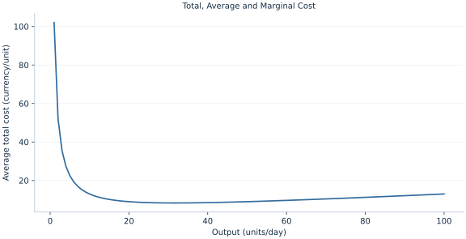

# Lab 10 · Total, Average and Marginal Cost

> Why does marginal cost cross average cost at its minimum?

## Start with the supplied observations

Download [cost_curves.xlsx](cost_curves.xlsx) and [the complete Python analysis](lab.py). Import the workbook into OpenEconometrics without renaming it. Open the complete Python file in an empty Python document and run the whole file. The first sheet, **Data**, contains the observations. **Dictionary** explains variables, coding, units and missing cells.

For ordinary Python, keep the workbook beside `lab.py`. For another location, use `from lab import run_lab`, then `run_lab(data_path="/path/to/cost_curves.xlsx")`. Keep the supplied workbook intact and use a copy for transformations. The [LaTeX result table](table.tex) accompanies the chapter.

The workbook contains **100 original synthetic observations**. Its observational unit is: One feasible output level. These are teaching observations, not an empirical estimate about an actual business, population or policy. Every student starts from the same stored values and missing cells.

| Variable | Meaning | Unit or coding | Missing cells |
|---|---|---|---:|
| `quantity` | Output | units/day | 0 |
| `total_cost` | Cost 100+2q+.1q² | currency/day | 0 |

## 1. Build the comparison

Average total cost divides all costs by output. Average variable cost excludes fixed cost. Marginal cost differentiates total cost with respect to output; it describes a small expansion, not the average cost of all existing production.

When marginal cost is below average cost, adding output pulls the average down. When marginal cost is above average cost, the average rises. At a smooth interior minimum, they coincide. The fixed-cost component is spread over output, generating a falling average fixed cost even when variable marginal cost rises.

$$
C(q)=100+2q+.1q^2,\ ATC=100/q+2+.1q,\ AVC=2+.1q,\ MC=2+.2q.
$$

Differentiate ATC: −100/q²+.1=0 gives q=sqrt(100/.1). Substitute this output into MC and ATC to verify equality. The integer grid may choose 32 even though the continuous optimum is about 31.62; do not describe a grid maximum as an exact derivative solution.

## 2. State the assumptions and sample

Output is positive and divisible, the cost schedule is deterministic, and the 100 fixed cost is distinguished from variable costs. Values at q=0 are excluded because average cost is undefined there.

**Pause before running.** Calculate ATC at q=50.

## 3. Follow the application

The complete file loads the supplied observations, applies the chapter's explicit sample rule, computes the procedure and displays the result, a chart and a compact numerical table. The following shortened call highlights the statistical operation. `load_data()` and the other chapter helpers are defined in the full file; run that file before using the snippet.

```python
import openecon as oe

raw = load_data()
q = raw.quantity
display(oe.DataFrame({"quantity": q, "ATC": raw.total_cost / q,
                      "AVC": (raw.total_cost - 100) / q, "MC": 2 + .2*q}))
```

Read the output in this order: establish which observations were used, identify the quantity being compared, inspect the amount of variation or uncertainty, and then interpret the result in the units of the question. A large statistic without its denominator, sample and comparison cannot explain the result. The final numerical table puts the quantities used in the worked discussion together; the procedure output retains the fuller set of tables.

## 4. Interpret the executed example

| Quantity | Computed value |
|---|---:|
| Fixed cost | 100 |
| Continuous min atc quantity | 31.6228 |
| Continuous min atc | 8.32456 |
| Mc at min atc | 8.32456 |
| Grid min atc quantity | 32 |
| Atc at 50 | 9 |
| Mc at 50 | 12 |

Continuous minimum ATC occurs at q=31.6228 with ATC=8.32456 and matching MC=8.32456. The grid selects 32. At q=50, ATC=9 and MC=12.



The chart is computed from the supplied scenarios using the stated equations. Its coordinates are retained with the numerical result. Read axis units before comparing its slopes; a change of scale can alter visual steepness without changing the underlying trade-off.

## 5. Decide what the evidence supports

Cost curves describe a specified technology and input-price environment. They do not determine market demand or prove that a firm can sell output at a profitable price.

## 6. Try it yourself

**A.** Calculate ATC at q=50.

**B.** Calculate MC at q=50.

**C.** Why do grid and continuous minima differ?

**D.** Is ATC defined at zero output?

## Further reading

[OpenStax, Principles of Microeconomics 3e](https://openstax.org/books/principles-microeconomics-3e/pages/1-introduction) is optional background reading. The models, scenarios, questions and analysis here are original; no textbook exercises or datasets are reproduced.
