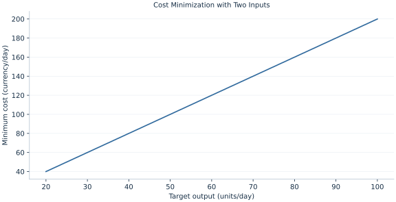

# Lab 11 · Cost Minimization with Two Inputs

> How can a firm produce a fixed output at minimum cost?

## Start with the supplied observations

Download [conditional_inputs.xlsx](conditional_inputs.xlsx) and [the complete Python analysis](lab.py). Import the workbook into OpenEconometrics without renaming it. Open the complete Python file in an empty Python document and run the whole file. The first sheet, **Data**, contains the observations. **Dictionary** explains variables, coding, units and missing cells.

For ordinary Python, keep the workbook beside `lab.py`. For another location, use `from lab import run_lab`, then `run_lab(data_path="/path/to/conditional_inputs.xlsx")`. Keep the supplied workbook intact and use a copy for transformations. The [LaTeX result table](table.tex) accompanies the chapter.

The workbook contains **6 original synthetic observations**. Its observational unit is: One target output/input-price scenario. These are teaching observations, not an empirical estimate about an actual business, population or policy. Every student starts from the same stored values and missing cells.

| Variable | Meaning | Unit or coding | Missing cells |
|---|---|---|---:|
| `output` | Target output | units/day | 0 |
| `wage` | Labor price | currency/L | 0 |
| `rental` | Capital rental | currency/K | 0 |

## 1. Build the comparison

Cost minimization chooses an input combination conditional on a required output. It is distinct from profit maximization, which also chooses how much output to sell. An isoquant contains combinations producing the same output, while an isocost line has slope −w/r.

With q=2 sqrt(LK), the marginal technical substitution rate equals K/L. At an interior cost minimum it equals the relative input price w/r. If labor becomes dearer, the firm substitutes capital for labor while maintaining output. Constant returns make minimized cost proportional to target output in this example.

$$
\min_{L,K>0}wL+rK\ s.t.\ 2\sqrt{LK}=q;\quad L^c=\frac q2\sqrt{r/w},\ K^c=\frac q2\sqrt{w/r}.
$$

Set K/L=w/r and combine with LK=q²/4. Taking positive roots gives conditional demands. Their cost is q sqrt(wr). Doubling both inputs doubles output, explaining the linear expansion path at fixed input prices.

## 2. State the assumptions and sample

Inputs are divisible, both prices positive, technology known and no fixed cost or capacity constraint applies. The final row changes wage only while keeping target output 60.

**Pause before running.** What is K/L at the base prices?

## 3. Follow the application

The complete file loads the supplied observations, applies the chapter's explicit sample rule, computes the procedure and displays the result, a chart and a compact numerical table. The following shortened call highlights the statistical operation. `load_data()` and the other chapter helpers are defined in the full file; run that file before using the snippet.

```python
import openecon as oe

raw = load_data()
labor = raw.output / 2 * (raw.rental / raw.wage)**.5
capital = raw.output / 2 * (raw.wage / raw.rental)**.5
display(oe.DataFrame({"output": raw.output, "labor": labor, "capital": capital,
                      "cost": raw.wage*labor + raw.rental*capital}))
```

Read the output in this order: establish which observations were used, identify the quantity being compared, inspect the amount of variation or uncertainty, and then interpret the result in the units of the question. A large statistic without its denominator, sample and comparison cannot explain the result. The final numerical table puts the quantities used in the worked discussion together; the procedure output retains the fuller set of tables.

## 4. Interpret the executed example

| Quantity | Computed value |
|---|---:|
| Base output | 60 |
| Base labor | 15 |
| Base capital | 60 |
| Base cost | 120 |
| High wage labor | 10 |
| High wage capital | 90 |
| High wage cost | 180 |
| Base capital labor ratio | 4 |

At output 60, labor=15, capital=60 and minimized cost=120. Raising wage to 9 changes labor to 10 and capital to 90, at cost 180.



The chart is computed from the supplied scenarios using the stated equations. Its coordinates are retained with the numerical result. Read axis units before comparing its slopes; a change of scale can alter visual steepness without changing the underlying trade-off.

## 5. Decide what the evidence supports

The solution relies on interior substitutability. Fixed-proportion technology or adjustment constraints would invalidate the tangency calculation.

## 6. Try it yourself

**A.** What is K/L at the base prices?

**B.** Check the base production constraint.

**C.** What happens when labor becomes dearer?

**D.** Does cost minimization choose market output?

## Further reading

[OpenStax, Principles of Microeconomics 3e](https://openstax.org/books/principles-microeconomics-3e/pages/1-introduction) is optional background reading. The models, scenarios, questions and analysis here are original; no textbook exercises or datasets are reproduced.
