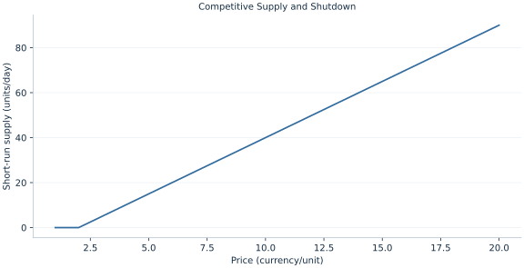

# Lab 12 · Competitive Supply and Shutdown

> Why might a firm produce while making a loss?

## Start with the supplied observations

Download [competitive_supply.xlsx](competitive_supply.xlsx) and [the complete Python analysis](lab.py). Import the workbook into OpenEconometrics without renaming it. Open the complete Python file in an empty Python document and run the whole file. The first sheet, **Data**, contains the observations. **Dictionary** explains variables, coding, units and missing cells.

For ordinary Python, keep the workbook beside `lab.py`. For another location, use `from lab import run_lab`, then `run_lab(data_path="/path/to/competitive_supply.xlsx")`. Keep the supplied workbook intact and use a copy for transformations. The [LaTeX result table](table.tex) accompanies the chapter.

The workbook contains **20 original synthetic observations**. Its observational unit is: One output-price scenario for a firm. These are teaching observations, not an empirical estimate about an actual business, population or policy. Every student starts from the same stored values and missing cells.

| Variable | Meaning | Unit or coding | Missing cells |
|---|---|---|---:|
| `price` | Output price | currency/unit | 0 |
| `fixed_cost` | Unavoidable short-run fixed cost | currency/day | 0 |
| `linear_cost` | Linear variable cost coefficient | currency/unit | 0 |
| `quadratic_cost` | Quadratic coefficient | currency/unit² | 0 |

## 1. Build the comparison

Short-run output decisions compare revenue with avoidable variable cost. If fixed cost is already unavoidable, producing can reduce a loss even when total revenue does not cover total cost. Shutdown leaves the fixed cost unpaid by revenue but avoids variable costs.

For an interior price-taking producer, price equals marginal cost on its upward branch. The firm also compares that candidate with zero output. Here AVC=2+.1q approaches 2 as q approaches zero, yielding a shutdown boundary of 2 and a nonnegative supply rule.

$$
q^s(P)=\max\{0,(P-2)/.2\},\quad \pi=Pq-100-2q-.1q^2.
$$

Differentiate profit with respect to q: P−2−.2q=0. If the unconstrained solution is negative, impose q=0. At price 12, q=50 and profit is revenue 600 minus total cost 450. At price 1, producing would worsen the unavoidable loss.

## 2. State the assumptions and sample

Price taking, convex variable cost and unavoidable fixed cost apply in the short run. Output is continuous. Exit with avoidable fixed costs is a different horizon.

**Pause before running.** Find q at price 12.

## 3. Follow the application

The complete file loads the supplied observations, applies the chapter's explicit sample rule, computes the procedure and displays the result, a chart and a compact numerical table. The following shortened call highlights the statistical operation. `load_data()` and the other chapter helpers are defined in the full file; run that file before using the snippet.

```python
import openecon as oe

raw = load_data()
quantity = ((raw.price - raw.linear_cost) / (2 * raw.quadratic_cost)).clip(lower=0)
profit = raw.price*quantity - raw.fixed_cost - raw.linear_cost*quantity - raw.quadratic_cost*quantity**2
display(oe.DataFrame({"price": raw.price, "quantity": quantity, "profit": profit}))
```

Read the output in this order: establish which observations were used, identify the quantity being compared, inspect the amount of variation or uncertainty, and then interpret the result in the units of the question. A large statistic without its denominator, sample and comparison cannot explain the result. The final numerical table puts the quantities used in the worked discussion together; the procedure output retains the fuller set of tables.

## 4. Interpret the executed example

| Quantity | Computed value |
|---|---:|
| Quantity at price 12 | 50 |
| Profit at price 12 | 150 |
| Quantity at price 1 | 0 |
| Shutdown profit | -100 |
| Shutdown price boundary | 2 |

At price 12, supply is 50 and profit 150. At price 1, output is 0 and profit -100. The shutdown boundary is 2 currency/unit.



The chart is computed from the supplied scenarios using the stated equations. Its coordinates are retained with the numerical result. Read axis units before comparing its slopes; a change of scale can alter visual steepness without changing the underlying trade-off.

## 5. Decide what the evidence supports

A short-run supply rule does not establish long-run industry equilibrium or entry. Positive profit can attract entry if technology and market conditions permit it.

## 6. Try it yourself

**A.** Find q at price 12.

**B.** Why is shutdown profit negative?

**C.** Could output be positive with negative total profit?

**D.** Does p=MC always imply a maximum?

## Further reading

[OpenStax, Principles of Microeconomics 3e](https://openstax.org/books/principles-microeconomics-3e/pages/1-introduction) is optional background reading. The models, scenarios, questions and analysis here are original; no textbook exercises or datasets are reproduced.
