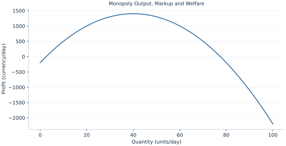

# Lab 13 · Monopoly Output, Markup and Welfare

> Why does a monopolist restrict output relative to a competitive benchmark?

## Start with the supplied observations

Download [monopoly_welfare.xlsx](monopoly_welfare.xlsx) and [the complete Python analysis](lab.py). Import the workbook into OpenEconometrics without renaming it. Open the complete Python file in an empty Python document and run the whole file. The first sheet, **Data**, contains the observations. **Dictionary** explains variables, coding, units and missing cells.

For ordinary Python, keep the workbook beside `lab.py`. For another location, use `from lab import run_lab`, then `run_lab(data_path="/path/to/monopoly_welfare.xlsx")`. Keep the supplied workbook intact and use a copy for transformations. The [LaTeX result table](table.tex) accompanies the chapter.

The workbook contains **101 original synthetic observations**. Its observational unit is: One market quantity on inverse demand. These are teaching observations, not an empirical estimate about an actual business, population or policy. Every student starts from the same stored values and missing cells.

| Variable | Meaning | Unit or coding | Missing cells |
|---|---|---|---:|
| `quantity` | Market output | units/day | 0 |
| `price` | Inverse demand 100−q | currency/unit | 0 |
| `marginal_cost` | Constant marginal cost | currency/unit | 0 |
| `fixed_cost` | Common fixed cost | currency/day | 0 |

## 1. Build the comparison

A monopolist faces the market demand curve and accounts for the price reduction needed to sell extra units. Marginal revenue therefore lies below price for a downward-sloping demand curve. Setting price equal to marginal cost would ignore revenue lost on existing units.

Output restriction transfers some surplus from consumers to the producer and prevents additional mutually beneficial trades. The transfer is not itself deadweight loss. The loss is the value of the trades between monopoly and competitive output whose willingness to pay exceeds marginal cost. A common fixed cost affects profit and total welfare levels but cancels from this output comparison.

$$
P=100-Q,\ MR=100-2Q,\ MC=20;\quad Q_M=40,\ P_M=60,\ DWL=\tfrac12(Q_C-Q_M)(P_M-MC).
$$

Differentiate total revenue 100Q−Q². Equate MR to 20, compute the demand price and subtract both variable and fixed costs. Use the demand–MC area over forgone output for welfare loss; do not count all monopoly revenue as a social loss.

## 2. State the assumptions and sample

A single price, known linear demand, constant marginal cost and a common fixed cost 200 are assumed. The competitive benchmark is an output-allocation comparison with that cost held fixed, not a claimed free-entry equilibrium.

**Pause before running.** Find monopoly output.

## 3. Follow the application

The complete file loads the supplied observations, applies the chapter's explicit sample rule, computes the procedure and displays the result, a chart and a compact numerical table. The following shortened call highlights the statistical operation. `load_data()` and the other chapter helpers are defined in the full file; run that file before using the snippet.

```python
import openecon as oe

raw = load_data()
intercept = raw.price.iloc[0]
mc = raw.marginal_cost.iloc[0]
quantity = (intercept - mc) / 2
price = intercept - quantity
display(oe.DataFrame({"monopoly_quantity": [quantity], "monopoly_price": [price]}))
```

Read the output in this order: establish which observations were used, identify the quantity being compared, inspect the amount of variation or uncertainty, and then interpret the result in the units of the question. A large statistic without its denominator, sample and comparison cannot explain the result. The final numerical table puts the quantities used in the worked discussion together; the procedure output retains the fuller set of tables.

## 4. Interpret the executed example

| Quantity | Computed value |
|---|---:|
| Monopoly quantity | 40 |
| Monopoly price | 60 |
| Monopoly profit | 1400 |
| Consumer surplus monopoly | 800 |
| Variable producer surplus | 1600 |
| Competitive quantity | 80 |
| Deadweight loss | 800 |
| Markup fraction | 0.666667 |

Monopoly sells 40 at price 60, earning profit 1400 after fixed cost. Consumer surplus is 800 and variable producer surplus 1600. Competitive quantity is 80; deadweight loss is 800.



The chart is computed from the supplied scenarios using the stated equations. Its coordinates are retained with the numerical result. Read axis units before comparing its slopes; a change of scale can alter visual steepness without changing the underlying trade-off.

## 5. Decide what the evidence supports

Price discrimination, dynamic innovation and entry can change these comparisons. The exercise is a static partial-equilibrium model, and producer surplus excludes the separately stated fixed cost.

## 6. Try it yourself

**A.** Find monopoly output.

**B.** Distinguish profit from variable producer surplus.

**C.** Calculate the loss triangle.

**D.** Is the transfer of consumer surplus to the firm all deadweight loss?

## Further reading

[OpenStax, Principles of Microeconomics 3e](https://openstax.org/books/principles-microeconomics-3e/pages/1-introduction) is optional background reading. The models, scenarios, questions and analysis here are original; no textbook exercises or datasets are reproduced.
