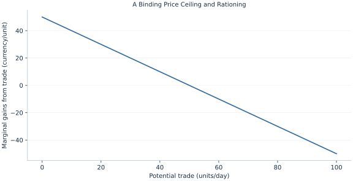

# Lab 14 · A Binding Price Ceiling and Rationing

> How can a lower legal price reduce total gains from trade?

## Start with the supplied observations

Download [price_ceiling.xlsx](price_ceiling.xlsx) and [the complete Python analysis](lab.py). Import the workbook into OpenEconometrics without renaming it. Open the complete Python file in an empty Python document and run the whole file. The first sheet, **Data**, contains the observations. **Dictionary** explains variables, coding, units and missing cells.

For ordinary Python, keep the workbook beside `lab.py`. For another location, use `from lab import run_lab`, then `run_lab(data_path="/path/to/price_ceiling.xlsx")`. Keep the supplied workbook intact and use a copy for transformations. The [LaTeX result table](table.tex) accompanies the chapter.

The workbook contains **101 original synthetic observations**. Its observational unit is: One potential trade on linear schedules. These are teaching observations, not an empirical estimate about an actual business, population or policy. Every student starts from the same stored values and missing cells.

| Variable | Meaning | Unit or coding | Missing cells |
|---|---|---|---:|
| `quantity` | Potential traded quantity | units/day | 0 |
| `demand_price` | Inverse demand 60−.5q | currency/unit | 0 |
| `supply_price` | Inverse supply 10+.5q | currency/unit | 0 |

## 1. Build the comparison

A binding ceiling fixes price below the market-clearing level. Buyers want more than sellers supply, so the short side limits trade. A shortage is a desired-quantity gap at the controlled price; it is not the quantity actually traded.

Consumer surplus depends on who receives the scarce units. The calculation here assumes the units go to buyers with the highest willingness to pay, an efficient rationing benchmark. Random queues or costly searching could reduce consumer gains further. Price transfers and losses from missing trades must be kept separate.

$$
P_c=25<35,\ Q_D=70,\ Q_S=30,\ Q_{trade}=30;\quad TS(Q)=\int_0^Q(50-q)dq.
$$

Invert the schedules to obtain willingness to pay 60−.5q and marginal supply cost 10+.5q. Integrate their difference to quantity 30. Comparing with the unconstrained optimum Q=50 gives the lost surplus.

## 2. State the assumptions and sample

The ceiling is enforced, supplied units trade, and rationing allocates them to the highest-value buyers. No search costs, black markets or quality changes are included.

**Pause before running.** What quantity trades?

## 3. Follow the application

The complete file loads the supplied observations, applies the chapter's explicit sample rule, computes the procedure and displays the result, a chart and a compact numerical table. The following shortened call highlights the statistical operation. `load_data()` and the other chapter helpers are defined in the full file; run that file before using the snippet.

```python
import openecon as oe

raw = load_data()
ceiling = 25.
quantity_demanded = (60 - ceiling) / .5
quantity_supplied = (ceiling - 10) / .5
display(oe.DataFrame({"demand": [quantity_demanded], "supply": [quantity_supplied],
                      "shortage": [quantity_demanded-quantity_supplied]}))
```

Read the output in this order: establish which observations were used, identify the quantity being compared, inspect the amount of variation or uncertainty, and then interpret the result in the units of the question. A large statistic without its denominator, sample and comparison cannot explain the result. The final numerical table puts the quantities used in the worked discussion together; the procedure output retains the fuller set of tables.

## 4. Interpret the executed example

| Quantity | Computed value |
|---|---:|
| Ceiling price | 25 |
| Demand at ceiling | 70 |
| Supply at ceiling | 30 |
| Shortage | 40 |
| Traded quantity | 30 |
| Consumer surplus efficient rationing | 825 |
| Producer surplus | 225 |
| Total surplus | 1050 |
| Deadweight loss | 200 |

Demand is 70, supply 30 and shortage 40. Only 30 units trade. Under efficient rationing, CS=825 and PS=225, totaling 1050; loss=200.



The chart is computed from the supplied scenarios using the stated equations. Its coordinates are retained with the numerical result. Read axis units before comparing its slopes; a change of scale can alter visual steepness without changing the underlying trade-off.

## 5. Decide what the evidence supports

The consumer surplus estimate is conditional on rationing. A lower posted price does not prove every buyer benefits or that everyone can obtain the good.

## 6. Try it yourself

**A.** What quantity trades?

**B.** How large is the shortage?

**C.** Calculate lost gains.

**D.** Would random rationing preserve computed CS?

## Further reading

[OpenStax, Principles of Microeconomics 3e](https://openstax.org/books/principles-microeconomics-3e/pages/1-introduction) is optional background reading. The models, scenarios, questions and analysis here are original; no textbook exercises or datasets are reproduced.
