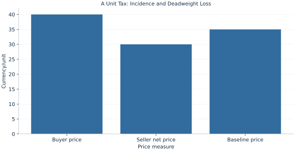

# Lab 15 · A Unit Tax: Incidence and Deadweight Loss

> Who bears a tax when the legal remitter is the seller?

## Start with the supplied observations

Download [tax_incidence.xlsx](tax_incidence.xlsx) and [the complete Python analysis](lab.py). Import the workbook into OpenEconometrics without renaming it. Open the complete Python file in an empty Python document and run the whole file. The first sheet, **Data**, contains the observations. **Dictionary** explains variables, coding, units and missing cells.

For ordinary Python, keep the workbook beside `lab.py`. For another location, use `from lab import run_lab`, then `run_lab(data_path="/path/to/tax_incidence.xlsx")`. Keep the supplied workbook intact and use a copy for transformations. The [LaTeX result table](table.tex) accompanies the chapter.

The workbook contains **101 original synthetic observations**. Its observational unit is: One potential trade on linear schedules. These are teaching observations, not an empirical estimate about an actual business, population or policy. Every student starts from the same stored values and missing cells.

| Variable | Meaning | Unit or coding | Missing cells |
|---|---|---|---:|
| `quantity` | Potential traded quantity | units/day | 0 |
| `demand_price` | Inverse demand 60−.5q | currency/unit | 0 |
| `supply_price` | Inverse supply 10+.5q | currency/unit | 0 |

## 1. Build the comparison

A unit tax creates a wedge between the price buyers pay and the net price sellers receive. Economic incidence is the change in those prices relative to the no-tax equilibrium, rather than the legal obligation to remit money. Relative slopes or elasticities determine the split.

Tax revenue is a transfer to government and belongs in this partial-equilibrium surplus accounting. The deadweight loss comes from trades discouraged by the wedge. Omitting revenue would overstate the loss by counting the transfer as a resource cost.

$$
P_B-P_S=t,\quad 60-.5Q-(10+.5Q)=t;\quad Q_t=50-t,\ DWL=\tfrac12t(50-Q_t).
$$

Solve the inverse-demand minus inverse-supply wedge for Q. Recover both prices at that common quantity. With symmetric slopes, the ten-unit tax raises the buyer price by five and lowers the seller price by five. Revenue is tax times traded quantity.

## 2. State the assumptions and sample

The tax is enforced without administration costs, revenue is valued one-for-one, curves are unchanged and there are no externalities or income effects. Both sides trade the same quantity.

**Pause before running.** Verify the wedge.

## 3. Follow the application

The complete file loads the supplied observations, applies the chapter's explicit sample rule, computes the procedure and displays the result, a chart and a compact numerical table. The following shortened call highlights the statistical operation. `load_data()` and the other chapter helpers are defined in the full file; run that file before using the snippet.

```python
import openecon as oe

raw = load_data()
tax = 10.
quantity = 50 - tax
buyer_price, seller_net_price = 60-.5*quantity, 10+.5*quantity
display(oe.DataFrame({"buyer_price": [buyer_price], "seller_net_price": [seller_net_price],
                      "tax_revenue": [tax*quantity]}))
```

Read the output in this order: establish which observations were used, identify the quantity being compared, inspect the amount of variation or uncertainty, and then interpret the result in the units of the question. A large statistic without its denominator, sample and comparison cannot explain the result. The final numerical table puts the quantities used in the worked discussion together; the procedure output retains the fuller set of tables.

## 4. Interpret the executed example

| Quantity | Computed value |
|---|---:|
| Unit tax | 10 |
| Buyer price | 40 |
| Seller net price | 30 |
| Taxed quantity | 40 |
| Buyer burden per unit | 5 |
| Seller burden per unit | 5 |
| Tax revenue | 400 |
| Consumer surplus | 400 |
| Producer surplus | 400 |
| Deadweight loss | 50 |

The 10 tax produces buyer price 40, seller net price 30 and quantity 40. Each side bears 5 per unit. Revenue=400 and loss=50.



The chart is computed from the supplied scenarios using the stated equations. Its coordinates are retained with the numerical result. Read axis units before comparing its slopes; a change of scale can alter visual steepness without changing the underlying trade-off.

## 5. Decide what the evidence supports

Equal incidence follows from the equal slopes here. It is not a general half-and-half rule, and statutory remittance alone cannot identify the economic burden.

## 6. Try it yourself

**A.** Verify the wedge.

**B.** Calculate revenue.

**C.** Calculate DWL.

**D.** Would collecting from buyers necessarily reverse incidence?

## Further reading

[OpenStax, Principles of Microeconomics 3e](https://openstax.org/books/principles-microeconomics-3e/pages/1-introduction) is optional background reading. The models, scenarios, questions and analysis here are original; no textbook exercises or datasets are reproduced.
