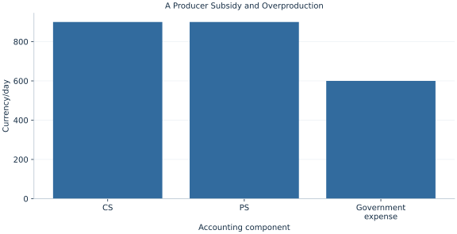

# Lab 16 · A Producer Subsidy and Overproduction

> Can buyers and sellers both gain while total surplus falls?

## Start with the supplied observations

Download [subsidy_welfare.xlsx](subsidy_welfare.xlsx) and [the complete Python analysis](lab.py). Import the workbook into OpenEconometrics without renaming it. Open the complete Python file in an empty Python document and run the whole file. The first sheet, **Data**, contains the observations. **Dictionary** explains variables, coding, units and missing cells.

For ordinary Python, keep the workbook beside `lab.py`. For another location, use `from lab import run_lab`, then `run_lab(data_path="/path/to/subsidy_welfare.xlsx")`. Keep the supplied workbook intact and use a copy for transformations. The [LaTeX result table](table.tex) accompanies the chapter.

The workbook contains **101 original synthetic observations**. Its observational unit is: One potential trade on linear schedules. These are teaching observations, not an empirical estimate about an actual business, population or policy. Every student starts from the same stored values and missing cells.

| Variable | Meaning | Unit or coding | Missing cells |
|---|---|---|---:|
| `quantity` | Potential traded quantity | units/day | 0 |
| `demand_price` | Inverse demand 60−.5q | currency/unit | 0 |
| `supply_price` | Inverse supply 10+.5q | currency/unit | 0 |

## 1. Build the comparison

A producer subsidy raises the receipt per unit above the price buyers pay. Both consumer and producer surplus can increase because the government finances the difference. Adding those private gains without subtracting fiscal expense would count a transfer as new social value.

Without a positive external benefit, the subsidy encourages trades beyond the efficient quantity. For those extra units marginal production cost exceeds buyer willingness to pay. The loss triangle is the gap between those curves over excess output. A policy intended to correct an externality would require a different welfare calculation.

$$
P_S-P_B=s,\quad Q_s=50+s,\quad TS_s=CS_s+PS_s-sQ_s,\quad DWL=\tfrac12s(Q_s-50).
$$

Equate supply receipt to buyer price plus subsidy, solve quantity, then recover prices. Compute consumer and producer triangles and subtract sQ. Keep receipts and payments distinct in each label.

## 2. State the assumptions and sample

No externality, government financing distortion, administration cost or price-induced curve shift is included. Fiscal expense is valued one-for-one. Quantities are continuous.

**Pause before running.** Verify the receipt wedge.

## 3. Follow the application

The complete file loads the supplied observations, applies the chapter's explicit sample rule, computes the procedure and displays the result, a chart and a compact numerical table. The following shortened call highlights the statistical operation. `load_data()` and the other chapter helpers are defined in the full file; run that file before using the snippet.

```python
import openecon as oe

raw = load_data()
subsidy = 10.
quantity = 50 + subsidy
buyer_price, seller_receipt = 60-.5*quantity, 10+.5*quantity
display(oe.DataFrame({"buyer_price": [buyer_price], "seller_receipt": [seller_receipt],
                      "government_expense": [subsidy*quantity]}))
```

Read the output in this order: establish which observations were used, identify the quantity being compared, inspect the amount of variation or uncertainty, and then interpret the result in the units of the question. A large statistic without its denominator, sample and comparison cannot explain the result. The final numerical table puts the quantities used in the worked discussion together; the procedure output retains the fuller set of tables.

## 4. Interpret the executed example

| Quantity | Computed value |
|---|---:|
| Unit subsidy | 10 |
| Buyer price | 30 |
| Seller receipt | 40 |
| Subsidized quantity | 60 |
| Consumer surplus | 900 |
| Producer surplus | 900 |
| Government expense | 600 |
| Net total surplus | 1200 |
| Deadweight loss | 50 |

Quantity rises to 60, buyer price falls to 30 and seller receipt rises to 40. CS and PS are 900 and 900; government expense is 600. Net surplus=1200 and loss=50.



The chart is computed from the supplied scenarios using the stated equations. Its coordinates are retained with the numerical result. Read axis units before comparing its slopes; a change of scale can alter visual steepness without changing the underlying trade-off.

## 5. Decide what the evidence supports

The conclusion depends on the no-externality benchmark. Positive spillovers could justify subsidizing some production, while costly public finance could make the fiscal burden larger.

## 6. Try it yourself

**A.** Verify the receipt wedge.

**B.** Compute government expense.

**C.** Why not add only CS and PS?

**D.** Could a subsidy improve welfare elsewhere?

## Further reading

[OpenStax, Principles of Microeconomics 3e](https://openstax.org/books/principles-microeconomics-3e/pages/1-introduction) is optional background reading. The models, scenarios, questions and analysis here are original; no textbook exercises or datasets are reproduced.
