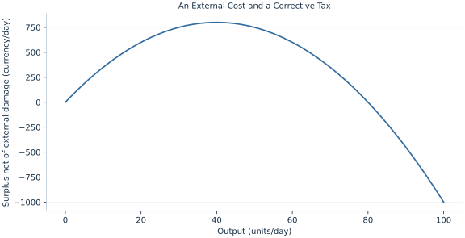

# Lab 17 · An External Cost and a Corrective Tax

> How does an unpriced external cost change efficient output?

## Start with the supplied observations

Download [external_cost.xlsx](external_cost.xlsx) and [the complete Python analysis](lab.py). Import the workbook into OpenEconometrics without renaming it. Open the complete Python file in an empty Python document and run the whole file. The first sheet, **Data**, contains the observations. **Dictionary** explains variables, coding, units and missing cells.

For ordinary Python, keep the workbook beside `lab.py`. For another location, use `from lab import run_lab`, then `run_lab(data_path="/path/to/external_cost.xlsx")`. Keep the supplied workbook intact and use a copy for transformations. The [LaTeX result table](table.tex) accompanies the chapter.

The workbook contains **101 original synthetic observations**. Its observational unit is: One potential market trade with an external cost. These are teaching observations, not an empirical estimate about an actual business, population or policy. Every student starts from the same stored values and missing cells.

| Variable | Meaning | Unit or coding | Missing cells |
|---|---|---|---:|
| `quantity` | Output | units/day | 0 |
| `demand_price` | Marginal benefit 60−.5q | currency/unit | 0 |
| `private_mc` | Private marginal cost 10+.5q | currency/unit | 0 |
| `external_mc` | Marginal external damage | currency/unit | 0 |

## 1. Build the comparison

Private supply reflects costs borne by producers. If production imposes uncompensated damage on others, social marginal cost exceeds private marginal cost. Unregulated buyers and sellers ignore that gap, leading to excessive output relative to the stated welfare objective.

A corrective tax equal to marginal external damage at the social optimum aligns the private wedge with the social cost. Tax payments are transfers; actual damage is a resource or welfare loss. Counting both the payment and the same damage as two separate costs would double count the correction mechanism.

$$
MSC=10+.5Q+10,\quad MB=60-.5Q,\quad Q^S=40,\quad W(Q)=\int_0^Q(MB-MSC)dq.
$$

Set marginal benefit equal to social marginal cost. The private quantity is 50, while adding ten to marginal cost lowers the efficient quantity to 40. Integrate 40−q to evaluate welfare with damage included, then compare the two quantities.

## 2. State the assumptions and sample

Marginal damage is constant and known, no other distortion exists, and tax enforcement is costless. The monetary damage measure is stipulated; no empirical emissions valuation is claimed.

**Pause before running.** Which marginal cost matters for welfare?

## 3. Follow the application

The complete file loads the supplied observations, applies the chapter's explicit sample rule, computes the procedure and displays the result, a chart and a compact numerical table. The following shortened call highlights the statistical operation. `load_data()` and the other chapter helpers are defined in the full file; run that file before using the snippet.

```python
import openecon as oe

raw = load_data()
damage = raw.external_mc.iloc[0]
social_quantity = 50 - damage
display(oe.DataFrame({"social_quantity": [social_quantity], "corrective_tax": [damage]}))
```

Read the output in this order: establish which observations were used, identify the quantity being compared, inspect the amount of variation or uncertainty, and then interpret the result in the units of the question. A large statistic without its denominator, sample and comparison cannot explain the result. The final numerical table puts the quantities used in the worked discussion together; the procedure output retains the fuller set of tables.

## 4. Interpret the executed example

| Quantity | Computed value |
|---|---:|
| Private quantity | 50 |
| Social optimal quantity | 40 |
| Corrective tax | 10 |
| Welfare at private quantity | 750 |
| Welfare at social optimum | 800 |
| Welfare gain | 50 |
| External damage at private quantity | 500 |

Private output is 50 and efficient output 40. A corrective tax of 10 implements that quantity. Welfare rises from 750 to 800, a gain of 50.



The chart is computed from the supplied scenarios using the stated equations. Its coordinates are retained with the numerical result. Read axis units before comparing its slopes; a change of scale can alter visual steepness without changing the underlying trade-off.

## 5. Decide what the evidence supports

A real corrective tax requires evidence about marginal damage and responses. Total damage at the original output is not the optimal unit tax.

## 6. Try it yourself

**A.** Which marginal cost matters for welfare?

**B.** Calculate the efficient quantity.

**C.** Why is the tax not total external damage?

**D.** Should tax revenue be subtracted again from welfare?

## Further reading

[OpenStax, Principles of Microeconomics 3e](https://openstax.org/books/principles-microeconomics-3e/pages/1-introduction) is optional background reading. The models, scenarios, questions and analysis here are original; no textbook exercises or datasets are reproduced.
