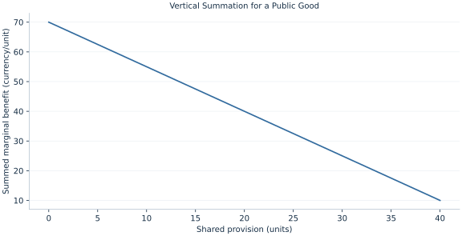

# Lab 18 · Vertical Summation for a Public Good

> Why are public-good marginal benefits added vertically?

## Start with the supplied observations

Download [public_good.xlsx](public_good.xlsx) and [the complete Python analysis](lab.py). Import the workbook into OpenEconometrics without renaming it. Open the complete Python file in an empty Python document and run the whole file. The first sheet, **Data**, contains the observations. **Dictionary** explains variables, coding, units and missing cells.

For ordinary Python, keep the workbook beside `lab.py`. For another location, use `from lab import run_lab`, then `run_lab(data_path="/path/to/public_good.xlsx")`. Keep the supplied workbook intact and use a copy for transformations. The [LaTeX result table](table.tex) accompanies the chapter.

The workbook contains **41 original synthetic observations**. Its observational unit is: One shared public-good quantity. These are teaching observations, not an empirical estimate about an actual business, population or policy. Every student starts from the same stored values and missing cells.

| Variable | Meaning | Unit or coding | Missing cells |
|---|---|---|---:|
| `quantity` | Shared provision | units | 0 |
| `mb_a` | Person A marginal benefit 40−q | currency/unit | 0 |
| `mb_b` | Person B marginal benefit 30−.5q | currency/unit | 0 |
| `mc` | Marginal provision cost | currency/unit | 0 |

## 1. Build the comparison

For a nonrival public good, both people consume the same provision level. One additional unit can benefit both simultaneously, so social marginal willingness to pay sums their values at that quantity. This vertical addition differs from adding quantities demanded for a rival private good at one common price.

Efficient provision equates the sum of marginal benefits with marginal provision cost. Personalized marginal contribution shares can illustrate the condition, but calculating them does not solve truthful preference revelation or voluntary-contribution incentives.

$$
MB_A=40-Q,\ MB_B=30-.5Q,\quad MB_A+MB_B=MC=25.
$$

Add the two marginal-benefit equations at the same Q, yielding 70−1.5Q. Equate to 25 to find Q=30. At that point A values an additional unit at 10 and B at 15; these sum to marginal cost. Integrating net marginal benefits gives total surplus.

## 2. State the assumptions and sample

The good is nonrival, benefits are monetized comparably, there are exactly two beneficiaries, and marginal cost is constant. The evaluated quantity lies where both marginal benefits are positive.

**Pause before running.** Why add benefits at the same Q?

## 3. Follow the application

The complete file loads the supplied observations, applies the chapter's explicit sample rule, computes the procedure and displays the result, a chart and a compact numerical table. The following shortened call highlights the statistical operation. `load_data()` and the other chapter helpers are defined in the full file; run that file before using the snippet.

```python
import openecon as oe

raw = load_data()
summed_benefit = raw.mb_a + raw.mb_b
display(oe.DataFrame({"quantity": raw.quantity, "summed_MB": summed_benefit,
                      "MC": raw.mc, "marginal_net_benefit": summed_benefit-raw.mc}))
```

Read the output in this order: establish which observations were used, identify the quantity being compared, inspect the amount of variation or uncertainty, and then interpret the result in the units of the question. A large statistic without its denominator, sample and comparison cannot explain the result. The final numerical table puts the quantities used in the worked discussion together; the procedure output retains the fuller set of tables.

## 4. Interpret the executed example

| Quantity | Computed value |
|---|---:|
| Efficient shared quantity | 30 |
| A marginal benefit | 10 |
| B marginal benefit | 15 |
| Sum marginal benefit | 25 |
| Marginal cost | 25 |
| Net total surplus | 675 |

Efficient shared quantity is 30. Marginal benefits are 10 and 15, summing to 25 against cost 25. Net surplus is 675 currency.



The chart is computed from the supplied scenarios using the stated equations. Its coordinates are retained with the numerical result. Read axis units before comparing its slopes; a change of scale can alter visual steepness without changing the underlying trade-off.

## 5. Decide what the evidence supports

The optimality condition is not a mechanism guaranteeing voluntary financing. Information, distribution and free-riding require separate institutional analysis.

## 6. Try it yourself

**A.** Why add benefits at the same Q?

**B.** Solve efficient provision.

**C.** Find marginal contribution shares.

**D.** Does this calculation eliminate free riding?

## Further reading

[OpenStax, Principles of Microeconomics 3e](https://openstax.org/books/principles-microeconomics-3e/pages/1-introduction) is optional background reading. The models, scenarios, questions and analysis here are original; no textbook exercises or datasets are reproduced.
