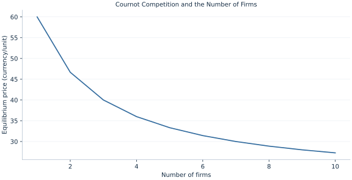

# Lab 19 · Cournot Competition and the Number of Firms

> How does strategic quantity competition change with the number of firms?

## Start with the supplied observations

Download [cournot_competition.xlsx](cournot_competition.xlsx) and [the complete Python analysis](lab.py). Import the workbook into OpenEconometrics without renaming it. Open the complete Python file in an empty Python document and run the whole file. The first sheet, **Data**, contains the observations. **Dictionary** explains variables, coding, units and missing cells.

For ordinary Python, keep the workbook beside `lab.py`. For another location, use `from lab import run_lab`, then `run_lab(data_path="/path/to/cournot_competition.xlsx")`. Keep the supplied workbook intact and use a copy for transformations. The [LaTeX result table](table.tex) accompanies the chapter.

The workbook contains **10 original synthetic observations**. Its observational unit is: One symmetric industry-size scenario. These are teaching observations, not an empirical estimate about an actual business, population or policy. Every student starts from the same stored values and missing cells.

| Variable | Meaning | Unit or coding | Missing cells |
|---|---|---|---:|
| `firms` | Number of identical firms | integer | 0 |
| `intercept` | Inverse demand intercept | currency/unit | 0 |
| `slope` | Inverse demand slope | currency/unit² | 0 |
| `mc` | Constant marginal cost | currency/unit | 0 |

## 1. Build the comparison

Cournot firms simultaneously choose quantities, taking rivals’ quantities as given when evaluating a deviation. A firm’s marginal revenue includes its own effect on market price. In a symmetric equilibrium all firms choose the same output, but symmetry is imposed after deriving an individual best response.

As the number of identical firms increases, each supplies less while total supply rises. Price approaches marginal cost in the limit. The one-firm case matches monopoly, providing a useful consistency check. These outcomes depend on quantity competition and should not be transferred automatically to price competition.

$$
\pi_i=(a-b(q_i+Q_{-i})-c)q_i,\quad q_i^*=\frac{a-c}{b(n+1)},\quad Q^*=nq_i^*.
$$

Differentiate an individual firm’s profit holding Q−i fixed, yielding a−c−bQ−i−2bqi=0. Then substitute Q−i=(n−1)qi. The remaining n+1 factor determines the symmetric solution.

## 2. State the assumptions and sample

Firms have identical constant marginal cost, no fixed cost or capacity constraint, a homogeneous product and simultaneous quantity choices. They neither collude nor enter endogenously in the supplied scenarios.

**Pause before running.** Derive duopoly output per firm.

## 3. Follow the application

The complete file loads the supplied observations, applies the chapter's explicit sample rule, computes the procedure and displays the result, a chart and a compact numerical table. The following shortened call highlights the statistical operation. `load_data()` and the other chapter helpers are defined in the full file; run that file before using the snippet.

```python
import openecon as oe

raw = load_data()
each = (raw.intercept-raw.mc) / (raw.slope*(raw.firms+1))
quantity = raw.firms*each
price = raw.intercept-raw.slope*quantity
display(oe.DataFrame({"firms": raw.firms, "per_firm": each, "total": quantity, "price": price}))
```

Read the output in this order: establish which observations were used, identify the quantity being compared, inspect the amount of variation or uncertainty, and then interpret the result in the units of the question. A large statistic without its denominator, sample and comparison cannot explain the result. The final numerical table puts the quantities used in the worked discussion together; the procedure output retains the fuller set of tables.

## 4. Interpret the executed example

| Quantity | Computed value |
|---|---:|
| Duopoly output per firm | 26.6667 |
| Duopoly total output | 53.3333 |
| Duopoly price | 46.6667 |
| Duopoly profit per firm | 711.111 |
| Monopoly quantity | 40 |
| Ten firm quantity | 72.7273 |
| Ten firm price | 27.2727 |
| Competitive limit quantity | 80 |

Duopoly output per firm is 26.6667, total 53.3333 and price 46.6667. Each earns 711.111. With ten firms price falls to 27.2727; the competitive-limit quantity is 80.



The chart is computed from the supplied scenarios using the stated equations. Its coordinates are retained with the numerical result. Read axis units before comparing its slopes; a change of scale can alter visual steepness without changing the underlying trade-off.

## 5. Decide what the evidence supports

The number of firms is an external scenario input. Entry costs, asymmetric costs, capacity and repeated-game collusion can produce different outcomes.

## 6. Try it yourself

**A.** Derive duopoly output per firm.

**B.** What does n=1 reproduce?

**C.** Does each firm increase output as n rises?

**D.** Would identical-cost Bertrand pricing give the same result?

## Further reading

[OpenStax, Principles of Microeconomics 3e](https://openstax.org/books/principles-microeconomics-3e/pages/1-introduction) is optional background reading. The models, scenarios, questions and analysis here are original; no textbook exercises or datasets are reproduced.
