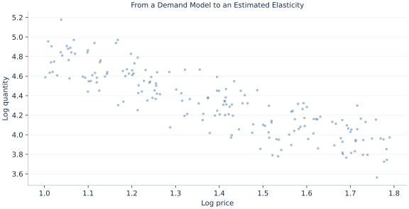

# Lab 20 · From a Demand Model to an Estimated Elasticity

> How can a log-demand coefficient be interpreted without confusing identification and fit?

## Start with the supplied observations

Download [estimated_demand.xlsx](estimated_demand.xlsx) and [the complete Python analysis](lab.py). Import the workbook into OpenEconometrics without renaming it. Open the complete Python file in an empty Python document and run the whole file. The first sheet, **Data**, contains the observations. **Dictionary** explains variables, coding, units and missing cells.

For ordinary Python, keep the workbook beside `lab.py`. For another location, use `from lab import run_lab`, then `run_lab(data_path="/path/to/estimated_demand.xlsx")`. Keep the supplied workbook intact and use a copy for transformations. The [LaTeX result table](table.tex) accompanies the chapter.

The workbook contains **180 original synthetic observations**. Its observational unit is: One synthetic market with exogenous prices and income. These are teaching observations, not an empirical estimate about an actual business, population or policy. Every student starts from the same stored values and missing cells.

| Variable | Meaning | Unit or coding | Missing cells |
|---|---|---|---:|
| `market_id` | Market identifier | ID | 0 |
| `price` | Exogenous price | currency/unit | 0 |
| `income` | Exogenous income index | currency | 0 |
| `quantity` | Observed demand | units/day | 0 |

## 1. Build the comparison

A log-log demand equation expresses conditional proportional responses. Holding log income fixed, the coefficient on log price is an elasticity of the conditional mean of log quantity. A one percent price increase corresponds approximately to βP percent change in quantity; for a large price change use the exact exponential transformation.

Estimation and identification are separate. Market-clearing prices can be correlated with unobserved demand shocks, making an ordinary price coefficient a poor demand estimate. The supplied mechanism deliberately assigns independent prices and income before adding demand noise, providing an exogeneity condition for this teaching example. HC3 changes uncertainty, not the fitted coefficients.

$$
\log Q_i=\beta_0+\beta_P\log P_i+\beta_I\log I_i+u_i,\quad \%\Delta Q=100[(1+\Delta P/P)^{\beta_P}-1].
$$

Take natural logs of positive supplied variables and fit a linear model with an intercept. The local elasticity is the price coefficient. A 10% price increase uses 100(1.1^βP−1), holding income and the log-error distribution fixed. The example also preserves full HC3 covariance and inference.

## 2. State the assumptions and sample

Prices and income are independent of the synthetic log-demand error by construction. All observations are positive and complete. HC3 inference addresses leverage and heteroskedasticity under independent rows; it does not repair price endogeneity.

**Pause before running.** Interpret the price coefficient.

## 3. Follow the application

The complete file loads the supplied observations, applies the chapter's explicit sample rule, computes the procedure and displays the result, a chart and a compact numerical table. The following shortened call highlights the statistical operation. `load_data()` and the other chapter helpers are defined in the full file; run that file before using the snippet.

```python
import openecon as oe

raw = load_data()
data = oe.DataFrame(
    raw.assign(
        log_price=raw.price.map(math.log),
        log_income=raw.income.map(math.log),
        log_quantity=raw.quantity.map(math.log),
    )
)
result = oe.ols(
    data=data,
    y="log_quantity",
    x=["log_price", "log_income"],
    covariance="HC3",
    missing="raise",
    device="cpu",
)
display(result)
```

Read the output in this order: establish which observations were used, identify the quantity being compared, inspect the amount of variation or uncertainty, and then interpret the result in the units of the question. A large statistic without its denominator, sample and comparison cannot explain the result. The final numerical table puts the quantities used in the worked discussion together; the procedure output retains the fuller set of tables.

## 4. Interpret the executed example

| Quantity | Computed value |
|---|---:|
| Markets | 180 |
| Price elasticity | -1.22405 |
| Price se | 0.041092 |
| Income elasticity | 0.521407 |
| Quantity change for 10 percent price rise | -11.0116 |

The estimated price elasticity is -1.22405 (HC3 SE 0.041092) and income elasticity 0.521407. The predicted response to a 10% price rise is -11.0116 percent. The sample contains 180 markets.



The chart is computed from the supplied scenarios using the stated equations. Its coordinates are retained with the numerical result. Read axis units before comparing its slopes; a change of scale can alter visual steepness without changing the underlying trade-off.

## 5. Decide what the evidence supports

The exogeneity argument applies to this mechanism. An actual demand study would need an identification design, instruments or other evidence; a high fit statistic would not establish it.

## 6. Try it yourself

**A.** Interpret the price coefficient.

**B.** Calculate the exact 10% response.

**C.** Does HC3 fix endogenous price?

**D.** Why are logs valid here?

## Further reading

[OpenStax, Principles of Microeconomics 3e](https://openstax.org/books/principles-microeconomics-3e/pages/1-introduction) is optional background reading. The models, scenarios, questions and analysis here are original; no textbook exercises or datasets are reproduced.
