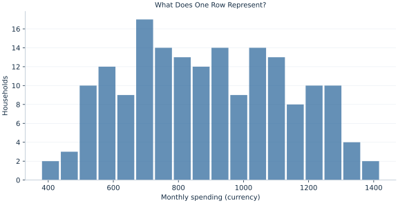

# Lab 01 · What Does One Row Represent?

> How should a household-spending table be organized before calculating an average?

## Start with the supplied observations

Download [household_measurements.xlsx](household_measurements.xlsx) and [the complete Python analysis](lab.py). Import the workbook into OpenEconometrics without renaming it. Open the complete Python file in an empty Python document and run the whole file. The first sheet, **Data**, contains the observations. **Dictionary** explains variables, coding, units and missing cells.

For ordinary Python, keep the workbook beside `lab.py`. For another location, use `from lab import run_lab`, then `run_lab(data_path="/path/to/household_measurements.xlsx")`. Keep the supplied workbook intact and use a copy for transformations. The [LaTeX result table](table.tex) accompanies the chapter.

The workbook contains **180 original synthetic observations**. Its observational unit is: One synthetic household. These are teaching observations, not an empirical estimate about an actual business, population or policy. Every student starts from the same stored values and missing cells.

| Variable | Meaning | Unit or coding | Missing cells |
|---|---|---|---:|
| `household_id` | Stable household identifier | integer ID | 0 |
| `region` | Synthetic region label | North or South | 0 |
| `household_size` | People in the household | people | 0 |
| `monthly_spending` | Reported monthly spending | hypothetical currency/month | 4 |

## 1. Build the comparison

A row identifies a household, rather than a person or a purchase. That choice determines the denominator of every average. Household size is a count, spending is a measured quantity, region is a category, and the household identifier is a label. Although an identifier is stored as an integer, its arithmetic mean has no substantive meaning.

The spending column has four missing reports. These households still belong to the raw dataset. An observed-spending average uses only households whose spending was recorded. Zero spending would be an observed value, and would remain in that average. An empty cell means the spending amount is unknown. The workbook keeps that distinction visible.

$$
\bar C_{obs}=\frac{1}{n_{obs}}\sum_{i:C_i\ observed}C_i,\qquad \overline{C/H}=\frac{1}{n_{obs}}\sum_{i:C_i\ observed}\frac{C_i}{H_i}.
$$

The first expression averages household totals. The second first divides each household's spending by its number of people and then averages those household-specific ratios. They answer different questions. An individual-weighted average would instead divide total spending by total household members. Choosing a ratio is part of defining the target, rather than a formatting decision.

## 2. State the assumptions and sample

Select observed spending explicitly and retain household IDs. Each household appears once and household size is positive. The generated records are independent for this exercise. In a real survey, unequal selection probabilities, clustering and nonresponse could require a different estimator and uncertainty calculation.

**Pause before running.** Would dropping blank spending cells change the unit from households to people?

## 3. Follow the application

The complete file loads the supplied observations, applies the chapter's explicit sample rule, computes the procedure and displays the result, a chart and a compact numerical table. The following shortened call highlights the statistical operation. `load_data()` and the other chapter helpers are defined in the full file; run that file before using the snippet.

```python
import openecon as oe

raw = load_data()
observed = raw.dropna(subset=["monthly_spending"])
result = oe.describe(
    observed, ["household_size", "monthly_spending"], stats=["n", "mean", "std_dev", "min", "max"]
)
display(result)
```

Read the output in this order: establish which observations were used, identify the quantity being compared, inspect the amount of variation or uncertainty, and then interpret the result in the units of the question. A large statistic without its denominator, sample and comparison cannot explain the result. The final numerical table puts the quantities used in the worked discussion together; the procedure output retains the fuller set of tables.

## 4. Interpret the executed example

| Quantity | Computed value |
|---|---:|
| Raw households | 180 |
| Observed spending | 176 |
| Missing spending | 4 |
| Mean spending | 888.985 |
| Mean spending per person | 299.558 |

There are 180 households, with 176 observed spending reports and 4 blanks. Mean household spending is 888.985 currency/month. The mean household-specific spending per person is 299.558 currency/person/month. Neither number should be labeled simply “average spending” without its denominator.



The histogram counts observed household reports. Its total is the retained household count, not the number of people represented by those households.

## 5. Decide what the evidence supports

Observed-case summaries describe the retained reports. They do not establish that the missing households would have had similar spending. Region labels are nominal categories and should be compared as groups, rather than coded as a numerical distance.

## 6. Try it yourself

**A.** State the raw count, observed-spending count and number of missing reports.

**B.** Why does an average of household IDs have no spending interpretation?

**C.** Write the formula for spending per represented person, and explain how it differs from the average of household-specific ratios.

**D.** Would entering zero in each blank cell solve the missing-data problem?

## Further reading

[OpenStax, Introductory Statistics 2e](https://openstax.org/books/introductory-statistics-2e/pages/1-introduction) provides background reading. The questions, observations and worked analysis are original.
