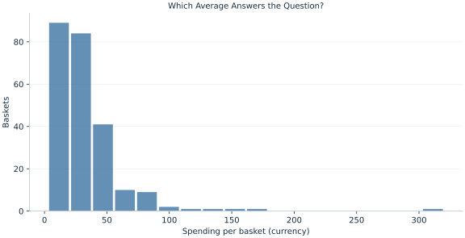

# Lab 02 · Which Average Answers the Question?

> Which summary would a shop use for total revenue, and which describes a basket near the middle?

## Start with the supplied observations

Download [shop_spending.xlsx](shop_spending.xlsx) and [the complete Python analysis](lab.py). Import the workbook into OpenEconometrics without renaming it. Open the complete Python file in an empty Python document and run the whole file. The first sheet, **Data**, contains the observations. **Dictionary** explains variables, coding, units and missing cells.

For ordinary Python, keep the workbook beside `lab.py`. For another location, use `from lab import run_lab`, then `run_lab(data_path="/path/to/shop_spending.xlsx")`. Keep the supplied workbook intact and use a copy for transformations. The [LaTeX result table](table.tex) accompanies the chapter.

The workbook contains **240 original synthetic observations**. Its observational unit is: One synthetic shopping basket. These are teaching observations, not an empirical estimate about an actual business, population or policy. Every student starts from the same stored values and missing cells.

| Variable | Meaning | Unit or coding | Missing cells |
|---|---|---|---:|
| `basket_id` | Stable basket identifier | integer ID | 0 |
| `spending` | Basket expenditure | hypothetical currency/basket | 0 |

## 1. Build the comparison

The arithmetic mean preserves addition: multiplying it by the number of baskets reconstructs total observed spending. The median locates the middle of the ordered baskets. A high-spending basket affects the mean according to its magnitude, while its rank determines its effect on the median. Neither summary is universally preferable; the question determines what must be preserved.

The geometric mean averages logarithms and then returns to the original units. For strictly positive spending, it describes a multiplicative center. It does not reconstruct total revenue by multiplication with the number of baskets.

$$
\bar x=\frac{\sum_i x_i}{n},\qquad m=\frac{x_{(n/2)}+x_{(n/2+1)}}2,\qquad g=\exp\!\left(\frac1n\sum_i\log x_i\right).
$$

There are 240 baskets, so the median averages order positions 120 and 121 using one-based indexing. Removing the largest basket changes both the numerator and denominator of the mean. Compare the original mean with this sensitivity calculation while retaining the original dataset as the primary analysis.

## 2. State the assumptions and sample

Every supplied spending value is positive, permitting the logarithm. The largest basket is deliberately retained as a valid synthetic observation. There is no evidence of a recording error that would justify deleting it. The native percentile convention averages adjacent order statistics when the percentile position is an integer.

**Pause before running.** Predict which will be largest: arithmetic mean, median or geometric mean. Explain why a right tail matters.

## 3. Follow the application

The complete file loads the supplied observations, applies the chapter's explicit sample rule, computes the procedure and displays the result, a chart and a compact numerical table. The following shortened call highlights the statistical operation. `load_data()` and the other chapter helpers are defined in the full file; run that file before using the snippet.

```python
import openecon as oe

raw = load_data()
result = oe.describe(raw, ["spending"], stats=["n", "mean", "std_dev", "p25", "p50", "p75", "max"])
display(result)
```

Read the output in this order: establish which observations were used, identify the quantity being compared, inspect the amount of variation or uncertainty, and then interpret the result in the units of the question. A large statistic without its denominator, sample and comparison cannot explain the result. The final numerical table puts the quantities used in the worked discussion together; the procedure output retains the fuller set of tables.

## 4. Interpret the executed example

| Quantity | Computed value |
|---|---:|
| Baskets | 240 |
| Mean | 32.439 |
| Median | 24.6907 |
| Geometric mean | 24.586 |
| Mean without largest | 31.2358 |
| Largest value | 320 |
| Mean change remove largest | 1.20318 |

The mean is 32.439 currency/basket, the median 24.6907, and the geometric mean 24.586. Removing the largest basket changes the mean to 31.2358. The difference of 1.20318 currency measures sensitivity to this particular tail observation; it is not a correction for bias.



The right tail explains why a revenue-relevant average can exceed a central basket. Bin counts describe the distribution but do not determine the definitions of its mean or median.

## 5. Decide what the evidence supports

An unusual value warrants investigation, rather than automatic exclusion. A median can be stable while total expenditure changes substantially. A log transformation changes the quantity being averaged, and exponentiating mean log spending does not recover arithmetic mean spending.

## 6. Try it yourself

**A.** Which mean reconstructs total observed revenue?

**B.** Explain the difference between the original mean and the mean without the largest basket.

**C.** If every basket's spending doubles, what happens to the three centers?

**D.** Should the shop replace its revenue calculation with the median because the median is less sensitive?

## Further reading

[OpenStax, Introductory Statistics 2e](https://openstax.org/books/introductory-statistics-2e/pages/1-introduction) provides background reading. The questions, observations and worked analysis are original.
