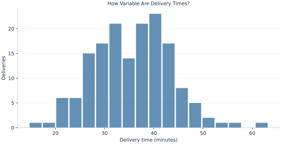

# Lab 03 · How Variable Are Delivery Times?

> How can two delivery processes have similar means but different reliability?

## Start with the supplied observations

Download [delivery_variation.xlsx](delivery_variation.xlsx) and [the complete Python analysis](lab.py). Import the workbook into OpenEconometrics without renaming it. Open the complete Python file in an empty Python document and run the whole file. The first sheet, **Data**, contains the observations. **Dictionary** explains variables, coding, units and missing cells.

For ordinary Python, keep the workbook beside `lab.py`. For another location, use `from lab import run_lab`, then `run_lab(data_path="/path/to/delivery_variation.xlsx")`. Keep the supplied workbook intact and use a copy for transformations. The [LaTeX result table](table.tex) accompanies the chapter.

The workbook contains **160 original synthetic observations**. Its observational unit is: One synthetic parcel delivery. These are teaching observations, not an empirical estimate about an actual business, population or policy. Every student starts from the same stored values and missing cells.

| Variable | Meaning | Unit or coding | Missing cells |
|---|---|---|---:|
| `delivery_id` | Delivery identifier | integer ID | 0 |
| `minutes` | Elapsed delivery time | minutes | 0 |

## 1. Build the comparison

A mean describes location. Dispersion describes how widely deliveries vary around that location. The sample variance squares each deviation, so large deviations receive more weight. Its units are minutes squared. Taking the square root returns the standard deviation to minutes, making it directly comparable with delivery times.

The interquartile range spans the middle half of the ordered values. It responds differently to tails because it uses two quantiles rather than every squared deviation. A coefficient of variation divides standard deviation by the mean and is useful only when the scale has a meaningful zero and the mean is positive.

$$
s^2=\frac{\sum_i(x_i-\bar x)^2}{n-1},\qquad s=\sqrt{s^2},\qquad IQR=Q_{.75}-Q_{.25},\qquad CV=s/\bar x.
$$

Estimating the sample mean uses one degree of freedom: the centered deviations sum to zero, leaving n−1 independent deviations. Converting minutes to hours divides each deviation by 60. Variance therefore divides by 3600 and standard deviation by 60. The coefficient of variation stays unchanged under positive rescaling.

## 2. State the assumptions and sample

The 160 deliveries are independent synthetic observations measured on the same elapsed-time scale. Use the sample variance convention with denominator n−1. Do not mix it with a population variance using denominator n. The example compares units, rather than estimating a service-level failure probability from a normal approximation.

**Pause before running.** Will converting minutes to hours divide the variance by 60 or by 3600?

## 3. Follow the application

The complete file loads the supplied observations, applies the chapter's explicit sample rule, computes the procedure and displays the result, a chart and a compact numerical table. The following shortened call highlights the statistical operation. `load_data()` and the other chapter helpers are defined in the full file; run that file before using the snippet.

```python
import openecon as oe

raw = load_data()
result = oe.describe(raw, ["minutes"], stats=["n", "mean", "std_dev", "p25", "p50", "p75"])
display(result)
```

Read the output in this order: establish which observations were used, identify the quantity being compared, inspect the amount of variation or uncertainty, and then interpret the result in the units of the question. A large statistic without its denominator, sample and comparison cannot explain the result. The final numerical table puts the quantities used in the worked discussion together; the procedure output retains the fuller set of tables.

## 4. Interpret the executed example

| Quantity | Computed value |
|---|---:|
| Deliveries | 160 |
| Mean minutes | 35.688 |
| Sample variance minutes squared | 62.508 |
| Sample sd minutes | 7.9062 |
| Iqr minutes | 11.2892 |
| Coefficient of variation | 0.221537 |
| Sample sd hours | 0.13177 |

The mean is 35.688 minutes and the sample standard deviation 7.9062 minutes. Variance is 62.508 minutes squared, while the IQR is 11.2892 minutes. The standard deviation expressed in hours is 0.13177. These describe the same deliveries under different units.



The histogram describes variation between deliveries. Its horizontal scale is an elapsed-time scale; a visually narrow histogram can be produced by changing axis limits without changing the underlying standard deviation.

## 5. Decide what the evidence supports

Standard deviation is not a standard error of the mean. A coefficient of variation is not appropriate for every numerical scale: a temperature scale with an arbitrary zero, for example, changes meaning under an additive shift. No single dispersion measure describes all tail behavior.

## 6. Try it yourself

**A.** Give the units of variance, standard deviation and IQR.

**B.** What happens to variance and standard deviation when minutes become hours?

**C.** Add five minutes to every delivery in a copy. Which summaries change?

**D.** Why is the sample standard deviation not an uncertainty interval for the average?

## Further reading

[OpenStax, Introductory Statistics 2e](https://openstax.org/books/introductory-statistics-2e/pages/1-introduction) provides background reading. The questions, observations and worked analysis are original.
