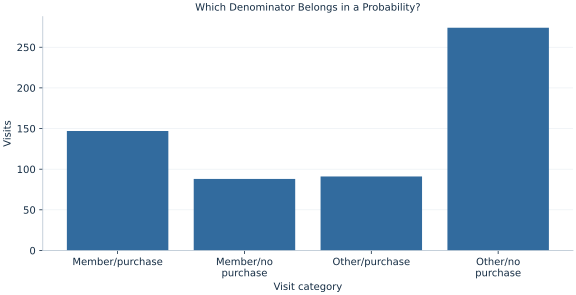

# Lab 04 · Which Denominator Belongs in a Probability?

> Is the purchase fraction among members the same quantity as the membership fraction among purchasers?

## Start with the supplied observations

Download [customer_events.xlsx](customer_events.xlsx) and [the complete Python analysis](lab.py). Import the workbook into OpenEconometrics without renaming it. Open the complete Python file in an empty Python document and run the whole file. The first sheet, **Data**, contains the observations. **Dictionary** explains variables, coding, units and missing cells.

For ordinary Python, keep the workbook beside `lab.py`. For another location, use `from lab import run_lab`, then `run_lab(data_path="/path/to/customer_events.xlsx")`. Keep the supplied workbook intact and use a copy for transformations. The [LaTeX result table](table.tex) accompanies the chapter.

The workbook contains **600 original synthetic observations**. Its observational unit is: One synthetic customer visit. These are teaching observations, not an empirical estimate about an actual business, population or policy. Every student starts from the same stored values and missing cells.

| Variable | Meaning | Unit or coding | Missing cells |
|---|---|---|---:|
| `visit_id` | Visit identifier | integer ID | 0 |
| `member` | Loyalty membership before visit | 0=no, 1=yes | 0 |
| `purchase` | Purchase during visit | 0=no, 1=yes | 0 |

## 1. Build the comparison

The sample space consists of customer visits. Two binary events divide those visits into four mutually exclusive cells: membership and purchase, membership without purchase, purchase without membership, and neither. A joint probability divides a cell count by all visits. A conditional probability changes the denominator to visits satisfying the condition.

Conditioning is not an instruction to multiply two marginal fractions. Under independence, the joint probability equals the product of the marginals. That equality is a claim about the relationship between the events, rather than a definition that always holds.

$$
P(M\cap P)=P(P\mid M)P(M),\qquad P(M\mid P)=\frac{P(M\cap P)}{P(P)}.
$$

To compute purchase among members, first restrict to membership visits and then count purchases. To reverse the conditioning, restrict to purchasers and count members. The numerator can be the same intersection while the denominators differ. The cross-tabulation makes both denominators inspectable.

## 2. State the assumptions and sample

Each visit appears once. The binary variables use 1 for the event and 0 for its complement. All cells are observed and neither condition has zero count. These are visit-weighted fractions; repeat customers would require care if the target were a customer-weighted probability.

**Pause before running.** Identify the denominator of each conditional fraction before opening the output.

## 3. Follow the application

The complete file loads the supplied observations, applies the chapter's explicit sample rule, computes the procedure and displays the result, a chart and a compact numerical table. The following shortened call highlights the statistical operation. `load_data()` and the other chapter helpers are defined in the full file; run that file before using the snippet.

```python
import openecon as oe

raw = load_data()
result = oe.crosstab(raw, "member", "purchase", expected=True, exact=False)
display(result)
members = raw.loc[raw.member == 1]
purchase_given_member = members.purchase.mean()
```

Read the output in this order: establish which observations were used, identify the quantity being compared, inspect the amount of variation or uncertainty, and then interpret the result in the units of the question. A large statistic without its denominator, sample and comparison cannot explain the result. The final numerical table puts the quantities used in the worked discussion together; the procedure output retains the fuller set of tables.

## 4. Interpret the executed example

| Quantity | Computed value |
|---|---:|
| Visits | 600 |
| P member | 0.391667 |
| P purchase | 0.396667 |
| P joint | 0.245 |
| P purchase given member | 0.625532 |
| P member given purchase | 0.617647 |
| Independence product | 0.155361 |
| Joint minus independence product | 0.0896389 |

The observed purchase fraction among members is 0.625532. The membership fraction among purchasers is 0.617647. Joint membership and purchase is 0.245, whereas the product of the marginal fractions is 0.155361. Their difference is 0.0896389 in this sample.



The four bars partition all @visits@ visits. The heights are joint cell counts. To read a conditional probability, sum the appropriate two bars for its denominator.

## 5. Decide what the evidence supports

These frequencies describe association. Membership is not randomized, so a higher purchase fraction among members does not identify the effect of becoming a member. A customer with many visits receives more visit weight than a customer with one visit.

## 6. Try it yourself

**A.** Write the correct denominator for purchase among members.

**B.** Reverse the conditioning and report the result.

**C.** What numerical identity would hold under independence?

**D.** Would the table justify offering membership as a causal intervention?

## Further reading

[OpenStax, Introductory Statistics 2e](https://openstax.org/books/introductory-statistics-2e/pages/1-introduction) provides background reading. The questions, observations and worked analysis are original.
