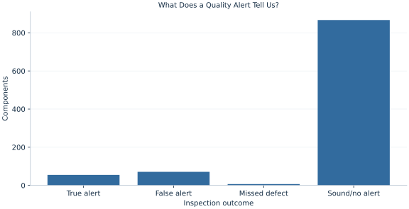

# Lab 05 · What Does a Quality Alert Tell Us?

> When the alert system flags a component, how likely is a real defect?

## Start with the supplied observations

Download [quality_alerts.xlsx](quality_alerts.xlsx) and [the complete Python analysis](lab.py). Import the workbook into OpenEconometrics without renaming it. Open the complete Python file in an empty Python document and run the whole file. The first sheet, **Data**, contains the observations. **Dictionary** explains variables, coding, units and missing cells.

For ordinary Python, keep the workbook beside `lab.py`. For another location, use `from lab import run_lab`, then `run_lab(data_path="/path/to/quality_alerts.xlsx")`. Keep the supplied workbook intact and use a copy for transformations. The [LaTeX result table](table.tex) accompanies the chapter.

The workbook contains **1000 original synthetic observations**. Its observational unit is: One synthetic manufactured component. These are teaching observations, not an empirical estimate about an actual business, population or policy. Every student starts from the same stored values and missing cells.

| Variable | Meaning | Unit or coding | Missing cells |
|---|---|---|---:|
| `component_id` | Component identifier | integer ID | 0 |
| `defect` | Inspection truth, observed for teaching | 0=sound, 1=defective | 0 |
| `alert` | Automated alert | 0=no, 1=yes | 0 |

## 1. Build the comparison

Sensitivity conditions on defective components and asks how often an alert appears. Specificity conditions on sound components and asks how often no alert appears. The factory's decision after seeing an alert asks the reverse question: among alerted components, what fraction are defective? That positive predictive value depends on the defect base rate as well as the alert system's conditional error rates.

Even a fairly sensitive system can generate many false alerts when defects are rare. There are many more sound components available to produce false positives. Bayes' theorem accounts for these two routes into the alerted group.

$$
P(D\mid A)=\frac{P(A\mid D)P(D)}{P(A\mid D)P(D)+P(A\mid \neg D)P(\neg D)}.
$$

The numerator is the fraction of all components that are defective and alerted. The denominator adds both kinds of alerts: true and false. Compute these terms from the confusion matrix before substituting them into the formula. Then compare the algebraic answer with the direct defective-among-alerted fraction.

## 2. State the assumptions and sample

For teaching, the workbook supplies inspection truth for every component, including those with no alert. In practice, inspecting only alerted components would prevent direct estimation of sensitivity and specificity. Holding those rates fixed while changing prevalence is a scenario assumption that may fail if the component mix changes.

**Pause before running.** Could most alerts be false even when most defects are detected?

## 3. Follow the application

The complete file loads the supplied observations, applies the chapter's explicit sample rule, computes the procedure and displays the result, a chart and a compact numerical table. The following shortened call highlights the statistical operation. `load_data()` and the other chapter helpers are defined in the full file; run that file before using the snippet.

```python
import openecon as oe

raw = load_data()
result = oe.crosstab(raw, "defect", "alert", expected=True, exact=False)
display(result)
alerted = raw.loc[raw.alert == 1]
positive_predictive_value = alerted.defect.mean()
```

Read the output in this order: establish which observations were used, identify the quantity being compared, inspect the amount of variation or uncertainty, and then interpret the result in the units of the question. A large statistic without its denominator, sample and comparison cannot explain the result. The final numerical table puts the quantities used in the worked discussion together; the procedure output retains the fuller set of tables.

## 4. Interpret the executed example

| Quantity | Computed value |
|---|---:|
| Components | 1000 |
| True positive | 55 |
| False positive | 71 |
| False negative | 7 |
| True negative | 867 |
| Prevalence | 0.062 |
| Sensitivity | 0.887097 |
| Specificity | 0.924307 |
| Positive predictive value | 0.436508 |
| Bayes predictive value | 0.436508 |
| Ppv at one percent prevalence | 0.10585 |

The observed prevalence is 0.062. Sensitivity is 0.887097 and specificity 0.924307. Among alerts, 0.436508 are real defects; the Bayes calculation gives the same 0.436508. At a hypothetical 1% prevalence, holding the conditional alert rates fixed, predictive value falls to 0.10585.



The bars count true alerts, false alerts, missed defects and sound components with no alert. Their total reconciles with @components@ inspected components. False alerts and missed defects have different operational costs.

## 5. Decide what the evidence supports

Positive predictive value is conditional on the alert and the relevant component population. Transporting it to another production line requires information about prevalence and conditional test behavior. The teaching example evaluates probabilities, not a complete cost-optimal inspection policy.

## 6. Try it yourself

**A.** State the denominator of sensitivity and of positive predictive value.

**B.** Use the confusion matrix to check Bayes' theorem.

**C.** What happens if prevalence becomes 1% while sensitivity and specificity remain fixed?

**D.** Why would inspecting only alerted components leave a gap?

## Further reading

[OpenStax, Introductory Statistics 2e](https://openstax.org/books/introductory-statistics-2e/pages/1-introduction) provides background reading. The questions, observations and worked analysis are original.
