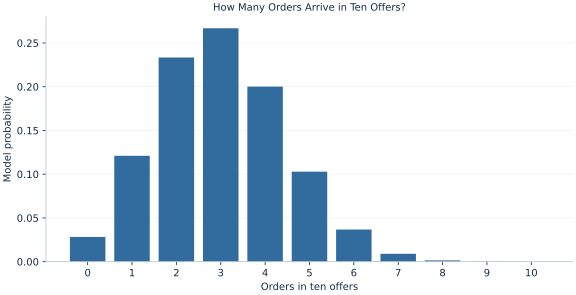

# Lab 06 · How Many Orders Arrive in Ten Offers?

> What is the probability of at least five orders from ten independent offers?

## Start with the supplied observations

Download [ten_offer_orders.xlsx](ten_offer_orders.xlsx) and [the complete Python analysis](lab.py). Import the workbook into OpenEconometrics without renaming it. Open the complete Python file in an empty Python document and run the whole file. The first sheet, **Data**, contains the observations. **Dictionary** explains variables, coding, units and missing cells.

For ordinary Python, keep the workbook beside `lab.py`. For another location, use `from lab import run_lab`, then `run_lab(data_path="/path/to/ten_offer_orders.xlsx")`. Keep the supplied workbook intact and use a copy for transformations. The [LaTeX result table](table.tex) accompanies the chapter.

The workbook contains **500 original synthetic observations**. Its observational unit is: One synthetic batch of ten independent offers. These are teaching observations, not an empirical estimate about an actual business, population or policy. Every student starts from the same stored values and missing cells.

| Variable | Meaning | Unit or coding | Missing cells |
|---|---|---|---:|
| `batch_id` | Batch identifier | integer ID | 0 |
| `orders` | Orders from ten Bernoulli offers with p=0.3 | orders, integer 0–10 | 0 |

## 1. Build the comparison

A binomial model counts successes in a fixed number of Bernoulli trials. Every batch has ten offers, each order is coded as a success, and the model assigns the same order probability 0.3 to each offer. The count can take only the integers zero through ten.

The combinatorial factor counts how many different success/failure arrangements produce the same total. A model probability is computed from this mechanism. An empirical fraction is computed from the 500 supplied batches. They can differ because the workbook contains one finite realization.

$$
P(X=k)=\binom{10}{k}(0.3)^k(0.7)^{10-k},\qquad E[X]=10(0.3),\quad Var(X)=10(0.3)(0.7).
$$

For a tail event, sum probabilities for every included count. “At least five” includes five, whereas “more than five” begins at six. The mean can also be recovered by summing k times its probability; the variance by summing squared deviations from that mean. These independent identities check the probability calculation.

## 2. State the assumptions and sample

The binomial mechanism assumes independent offers with constant success probability within a batch. Shared advertising shocks or heterogeneous response propensities can produce a different count distribution. The synthetic workbook uses the stated mechanism; it does not show that real offers satisfy it.

**Pause before running.** Does “at least five” include a batch with exactly five orders?

## 3. Follow the application

The complete file loads the supplied observations, applies the chapter's explicit sample rule, computes the procedure and displays the result, a chart and a compact numerical table. The following shortened call highlights the statistical operation. `load_data()` and the other chapter helpers are defined in the full file; run that file before using the snippet.

```python
import openecon as oe

raw = load_data()
result = oe.describe(raw, ["orders"], stats=["n", "mean", "std_dev", "min", "max"])
display(result)
# The complete file computes the binomial PMF with math.comb.
observed_tail_fraction = (raw.orders >= 5).mean()
```

Read the output in this order: establish which observations were used, identify the quantity being compared, inspect the amount of variation or uncertainty, and then interpret the result in the units of the question. A large statistic without its denominator, sample and comparison cannot explain the result. The final numerical table puts the quantities used in the worked discussion together; the procedure output retains the fuller set of tables.

## 4. Interpret the executed example

| Quantity | Computed value |
|---|---:|
| Batches | 500 |
| Empirical mean | 3.064 |
| Empirical variance | 2.13217 |
| Model mean | 3 |
| Model variance | 2.1 |
| P at least five | 0.150268 |
| Empirical fraction at least five | 0.158 |

The model mean is 3 orders and its variance 2.1 orders squared. The observed mean is 3.064 and sample variance 2.13217. The model probability of at least five orders is 0.150268, compared with an observed fraction 0.158.



The bars show model probability mass at each supported integer count. They sum to one. The chart is a discrete distribution, so probabilities belong to bars rather than areas under an arbitrary smooth curve.

## 5. Decide what the evidence supports

A close empirical mean does not validate independence or the full count distribution. A single fixed probability can miss batch-specific heterogeneity. Changing the number of offers changes both the support and the model moments.

## 6. Try it yourself

**A.** Give the binomial mean and variance for ten offers at p=0.3.

**B.** State the exact sum for the probability of at least five orders.

**C.** For twenty independent offers with the same p, predict the new mean and variance.

**D.** Why might a real batch distribution have heavier tails?

## Further reading

[OpenStax, Introductory Statistics 2e](https://openstax.org/books/introductory-statistics-2e/pages/1-introduction) provides background reading. The questions, observations and worked analysis are original.
