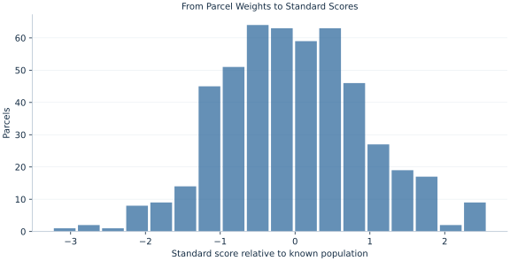

# Lab 07 · From Parcel Weights to Standard Scores

> How does a known normal weight model translate a gram threshold into a tail probability?

## Start with the supplied observations

Download [parcel_weights.xlsx](parcel_weights.xlsx) and [the complete Python analysis](lab.py). Import the workbook into OpenEconometrics without renaming it. Open the complete Python file in an empty Python document and run the whole file. The first sheet, **Data**, contains the observations. **Dictionary** explains variables, coding, units and missing cells.

For ordinary Python, keep the workbook beside `lab.py`. For another location, use `from lab import run_lab`, then `run_lab(data_path="/path/to/parcel_weights.xlsx")`. Keep the supplied workbook intact and use a copy for transformations. The [LaTeX result table](table.tex) accompanies the chapter.

The workbook contains **500 original synthetic observations**. Its observational unit is: One synthetic parcel. These are teaching observations, not an empirical estimate about an actual business, population or policy. Every student starts from the same stored values and missing cells.

| Variable | Meaning | Unit or coding | Missing cells |
|---|---|---|---:|
| `parcel_id` | Parcel identifier | integer ID | 0 |
| `grams` | Weight from a normal population with mean 1000 and SD 12 | grams | 0 |

## 1. Build the comparison

Standardization subtracts a location and divides by a scale. Here the generating population has mean 1000 grams and standard deviation 12 grams. A parcel weighing 1012 grams is one population standard deviation above the mean, regardless of the realized sample mean.

Under the stated normal model, the standardized value follows a standard normal distribution. The sample need not have exactly zero mean and unit sample standard deviation after this transformation because we used known population parameters, rather than estimating the centering and scaling from this sample.

$$
Z=\frac{W-1000}{12},\qquad P(W>1012)=P(Z>1)=1-\Phi(1).
$$

Subtracting 1000 changes location without changing dispersion. Dividing by 12 rescales every deviation. The sample mean of z is therefore (sample mean grams−1000)/12, and its sample standard deviation is the gram standard deviation divided by 12. Normal probabilities are computed using the error function, separately from observed tail counts.

## 2. State the assumptions and sample

The probability statement uses a normal population model and its known parameters. The finite workbook is one independent synthetic sample. A real quality-control model would need evidence about the distribution, stability and measurement process before using this tail probability.

**Pause before running.** Should the sample mean z be exactly zero when population parameters are known?

## 3. Follow the application

The complete file loads the supplied observations, applies the chapter's explicit sample rule, computes the procedure and displays the result, a chart and a compact numerical table. The following shortened call highlights the statistical operation. `load_data()` and the other chapter helpers are defined in the full file; run that file before using the snippet.

```python
import openecon as oe

raw = load_data()
result = oe.describe(raw, ["grams"], stats=["n", "mean", "std_dev", "min", "max"])
display(result)
z = (raw.grams - 1000) / 12
observed_fraction = (raw.grams > 1012).mean()
```

Read the output in this order: establish which observations were used, identify the quantity being compared, inspect the amount of variation or uncertainty, and then interpret the result in the units of the question. A large statistic without its denominator, sample and comparison cannot explain the result. The final numerical table puts the quantities used in the worked discussion together; the procedure output retains the fuller set of tables.

## 4. Interpret the executed example

| Quantity | Computed value |
|---|---:|
| Parcels | 500 |
| Sample mean grams | 999.669 |
| Sample sd grams | 11.5139 |
| Sample mean z | -0.0276202 |
| Sample sd z | 0.95949 |
| Model fraction above 1012 | 0.158655 |
| Observed fraction above 1012 | 0.138 |
| Model fraction within two sd | 0.9545 |

The sample mean is 999.669 grams and standard deviation 11.5139 grams. On the population-standardized scale, the sample mean is -0.0276202 and sample SD 0.95949. The normal-model upper-tail probability is 0.158655, while the observed fraction is 0.138.



The histogram uses standardized parcel weights. A value of two corresponds to 1024 grams. The chart displays observed frequencies, not an exact normal density.

## 5. Decide what the evidence supports

A standard score is a unit conversion relative to a reference distribution. It is not a p value by itself and does not establish that the observations are normally distributed. Using sample estimates would create a different standardization and introduce parameter uncertainty into a prediction task.

## 6. Try it yourself

**A.** Convert 1024 grams to a standard score.

**B.** Report model and observed upper-tail fractions at 1012 grams.

**C.** Why is the sample standard deviation of z not necessarily one?

**D.** What would justify using this normal tail for actual production?

## Further reading

[OpenStax, Introductory Statistics 2e](https://openstax.org/books/introductory-statistics-2e/pages/1-introduction) provides background reading. The questions, observations and worked analysis are original.
