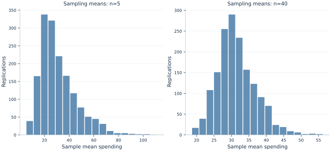

# Lab 08 · Why Do Averages Vary Less Than Observations?

> Why are repeated sample averages more stable than the spending of individual people?

## Start with the supplied observations

Download [spending_population.xlsx](spending_population.xlsx) and [the complete Python analysis](lab.py). Import the workbook into OpenEconometrics without renaming it. Open the complete Python file in an empty Python document and run the whole file. The first sheet, **Data**, contains the observations. **Dictionary** explains variables, coding, units and missing cells.

For ordinary Python, keep the workbook beside `lab.py`. For another location, use `from lab import run_lab`, then `run_lab(data_path="/path/to/spending_population.xlsx")`. Keep the supplied workbook intact and use a copy for transformations. The [LaTeX result table](table.tex) accompanies the chapter.

The workbook contains **1000 original synthetic observations**. Its observational unit is: One member of the finite synthetic population sampled with replacement. These are teaching observations, not an empirical estimate about an actual business, population or policy. Every student starts from the same stored values and missing cells.

| Variable | Meaning | Unit or coding | Missing cells |
|---|---|---|---:|
| `person_id` | Population member identifier | integer ID | 0 |
| `spending` | Positive daily spending | hypothetical currency/day | 0 |

## 1. Build the comparison

The workbook defines a finite synthetic population of 1000 spending values. A sampling experiment draws people with replacement from these fixed values. Because replacement restores the same population after each draw, draws within each sample are independent under the experiment. Repeat the experiment 1600 times for sample sizes five and forty.

Each replication produces a new sample mean. Their distribution is a sampling distribution, whereas the original spending histogram is a distribution of individual observations. The two have different meanings even though both are measured in currency.

$$
E[\bar X]=\mu,\qquad Var(\bar X)=\frac{\sigma^2}{n},\qquad SE(\bar X)=\frac{\sigma}{\sqrt n}.
$$

For this finite population, compute its exact variance with denominator N, since the workbook supplies the whole population being sampled. The formula divides that variance by sample size because covariances between independent draws are zero. Raising n from five to forty multiplies n by eight and divides the theoretical standard error by sqrt(8).

## 2. State the assumptions and sample

Sampling is explicitly with replacement from the supplied population. Without replacement, a finite-population correction would be needed. The CLT concerns the shape of standardized averages as n grows under appropriate conditions; it does not make the underlying right-skewed population normal or guarantee a good approximation for every small n.

**Pause before running.** Will multiplying sample size by eight divide the standard error by eight?

## 3. Follow the application

The complete file loads the supplied observations, applies the chapter's explicit sample rule, computes the procedure and displays the result, a chart and a compact numerical table. The following shortened call highlights the statistical operation. `load_data()` and the other chapter helpers are defined in the full file; run that file before using the snippet.

```python
import openecon as oe

raw = load_data()
summary, result, panels, checks, models = analyze(raw)
display(result)
# analyze draws repeated samples from the supplied population.
# It does not replace or regenerate the population workbook.
```

Read the output in this order: establish which observations were used, identify the quantity being compared, inspect the amount of variation or uncertainty, and then interpret the result in the units of the question. A large statistic without its denominator, sample and comparison cannot explain the result. The final numerical table puts the quantities used in the worked discussion together; the procedure output retains the fuller set of tables.

## 4. Interpret the executed example

| Quantity | Computed value |
|---|---:|
| Population size | 1000 |
| Population mean | 31.2451 |
| Population sd denominator n | 34.9047 |
| Replications | 1600 |
| Mean at n5 | 31.149 |
| Mean at n40 | 31.4171 |
| Empirical se n5 | 15.0153 |
| Empirical se n40 | 5.51486 |
| Theoretical se n5 | 15.6099 |
| Theoretical se n40 | 5.51892 |

Population mean spending is 31.2451 and population SD 34.9047. The empirical SD of sample means falls from 15.0153 at n=5 to 5.51486 at n=40. The theoretical values are 15.6099 and 5.51892. The average of replicated means approaches the same population mean in both experiments.



The panels compare two distributions of sample means with the same spending units. Their differing widths show sampling stability; they do not show that the individual population has become less unequal.

## 5. Decide what the evidence supports

The experiment has Monte Carlo error because it uses finitely many replications. Increasing replications stabilizes the estimated sampling distribution but does not reduce the standard error of an individual n-person sample mean. Increasing n and increasing the number of replications are different operations.

## 6. Try it yourself

**A.** Which variance convention is appropriate for the supplied population?

**B.** Give the theoretical standard errors for n=5 and n=40.

**C.** What changes if replications rise from 1600 to 6400 while n stays fixed?

**D.** Would the same formula hold for samples without replacement?

## Further reading

[OpenStax, Introductory Statistics 2e](https://openstax.org/books/introductory-statistics-2e/pages/1-introduction) provides background reading. The questions, observations and worked analysis are original.
