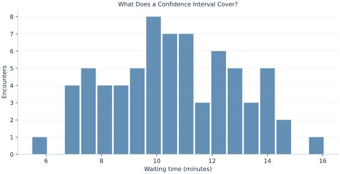

# Lab 09 · What Does a Confidence Interval Cover?

> What does a 95% confidence interval say about mean waiting time?

## Start with the supplied observations

Download [service_waits.xlsx](service_waits.xlsx) and [the complete Python analysis](lab.py). Import the workbook into OpenEconometrics without renaming it. Open the complete Python file in an empty Python document and run the whole file. The first sheet, **Data**, contains the observations. **Dictionary** explains variables, coding, units and missing cells.

For ordinary Python, keep the workbook beside `lab.py`. For another location, use `from lab import run_lab`, then `run_lab(data_path="/path/to/service_waits.xlsx")`. Keep the supplied workbook intact and use a copy for transformations. The [LaTeX result table](table.tex) accompanies the chapter.

The workbook contains **72 original synthetic observations**. Its observational unit is: One synthetic service encounter. These are teaching observations, not an empirical estimate about an actual business, population or policy. Every student starts from the same stored values and missing cells.

| Variable | Meaning | Unit or coding | Missing cells |
|---|---|---|---:|
| `encounter_id` | Encounter identifier | integer ID | 0 |
| `minutes` | Waiting time | minutes | 2 |

## 1. Build the comparison

The sample mean estimates a population mean. Its uncertainty depends on individual variation and the number of independent observations. We estimate the standard error with the sample standard deviation divided by the square root of the observed sample size. Student-t critical values account for estimating the variance under the normal independent model.

A confidence level describes a repeated procedure: in repeated sampling under its assumptions, a nominal 95% interval procedure covers the fixed population mean 95% of the time in the exact normal model. One computed interval either covers that mean or does not. The confidence level is not a posterior probability for the fixed mean after observing this interval.

$$
\bar x\ \pm\ t_{1-\alpha/2,n-1}\frac{s}{\sqrt n}.
$$

The interval is centered on the observed mean. Its half-width is the critical value times the standard error. Raising the confidence level from 95% to 99% uses a more extreme critical value, widening the interval on the same observations. In the native output, the statistics table reports an interval for the mean; the test table reports an interval for mean minus the hypothesized value.

## 2. State the assumptions and sample

Two of the 72 waiting-time reports are blank, leaving 70 observed encounters. Use those same rows for both confidence levels. Exact Student-t coverage requires independent normal observations; with nonnormal data, large-sample approximation needs separate justification. Complete cases may be selected if missingness relates to waiting time.

**Pause before running.** Will a 99% interval on the same rows be narrower or wider than the 95% interval?

## 3. Follow the application

The complete file loads the supplied observations, applies the chapter's explicit sample rule, computes the procedure and displays the result, a chart and a compact numerical table. The following shortened call highlights the statistical operation. `load_data()` and the other chapter helpers are defined in the full file; run that file before using the snippet.

```python
import openecon as oe

raw = load_data()
observed = raw.dropna(subset=["minutes"])
result = oe.ttest(observed, "minutes", mu=10, missing="raise")
display(result)
mean_interval = result["statistics"].loc["minutes", ["ci_low", "ci_high"]]
```

Read the output in this order: establish which observations were used, identify the quantity being compared, inspect the amount of variation or uncertainty, and then interpret the result in the units of the question. A large statistic without its denominator, sample and comparison cannot explain the result. The final numerical table puts the quantities used in the worked discussion together; the procedure output retains the fuller set of tables.

## 4. Interpret the executed example

| Quantity | Computed value |
|---|---:|
| Raw encounters | 72 |
| Observed encounters | 70 |
| Missing waits | 2 |
| Mean minutes | 10.6012 |
| Standard error | 0.275132 |
| Df | 69 |
| Ci95 low | 10.0523 |
| Ci95 high | 11.1501 |
| Ci99 low | 9.87237 |
| Ci99 high | 11.33 |

The mean is 10.6012 minutes with SE 0.275132 and 69 degrees of freedom. Its 95% interval is [10.0523, 11.1501] minutes. The same rows produce a 99% interval [9.87237, 11.33]. These are intervals for the population mean, not ranges expected to contain 95% or 99% of individual waits.



The histogram shows individual waits. Their spread is wider than uncertainty in the average because the mean combines 70 observations.

## 5. Decide what the evidence supports

A narrow confidence interval cannot repair biased selection, nonresponse or a poorly defined target population. An interval for a future individual wait requires individual variation as well as parameter uncertainty and answers a different prediction question.

## 6. Try it yourself

**A.** Report the sample used for inference.

**B.** Report both mean intervals with units.

**C.** What happens to the interval if every wait is converted from minutes to seconds?

**D.** Does the 95% interval contain 95% of individual waits?

## Further reading

[OpenStax, Introductory Statistics 2e](https://openstax.org/books/introductory-statistics-2e/pages/1-introduction) provides background reading. The questions, observations and worked analysis are original.
