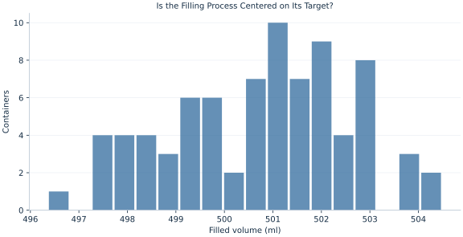

# Lab 10 · Is the Filling Process Centered on Its Target?

> Does the observed filling process differ from a 500 ml target, and is the difference operationally important?

## Start with the supplied observations

Download [filling_volumes.xlsx](filling_volumes.xlsx) and [the complete Python analysis](lab.py). Import the workbook into OpenEconometrics without renaming it. Open the complete Python file in an empty Python document and run the whole file. The first sheet, **Data**, contains the observations. **Dictionary** explains variables, coding, units and missing cells.

For ordinary Python, keep the workbook beside `lab.py`. For another location, use `from lab import run_lab`, then `run_lab(data_path="/path/to/filling_volumes.xlsx")`. Keep the supplied workbook intact and use a copy for transformations. The [LaTeX result table](table.tex) accompanies the chapter.

The workbook contains **80 original synthetic observations**. Its observational unit is: One synthetic filled container. These are teaching observations, not an empirical estimate about an actual business, population or policy. Every student starts from the same stored values and missing cells.

| Variable | Meaning | Unit or coding | Missing cells |
|---|---|---|---:|
| `container_id` | Container identifier | integer ID | 0 |
| `milliliters` | Filled volume | milliliters | 0 |

## 1. Build the comparison

A null hypothesis states a population comparison before seeing the data. Here H0 is a mean fill of 500 ml and the alternative is two-sided. The test statistic measures the observed mean deviation in estimated standard-error units. A two-sided p value counts outcomes at least as extreme in either direction under the null model.

A small p value does not measure the size of a discrepancy. The mean difference in milliliters and its uncertainty are needed to evaluate operational importance. A tolerance such as one milliliter would be a substantive standard that must be specified independently of whether a conventional significance threshold is crossed.

$$
H_0:\mu=500,\qquad t=\frac{\bar x-500}{s/\sqrt n},\qquad p=2P(T_{n-1}\ge|t_{obs}|).
$$

The numerator has units of milliliters and the denominator has the same units, leaving a dimensionless t statistic. Student-t degrees of freedom are 79 for 80 observations. The mean confidence interval can be compared with 500; the test table instead expresses its interval relative to that hypothesized target.

## 2. State the assumptions and sample

The supplied containers are independent normal synthetic draws with positive variance. The alternative is chosen two-sided before examining the sign. A real production time series may have serial dependence or changing calibration; treating such observations as independent can understate uncertainty.

**Pause before running.** If the estimated deviation is positive, does a two-sided test ignore evidence of underfilling?

## 3. Follow the application

The complete file loads the supplied observations, applies the chapter's explicit sample rule, computes the procedure and displays the result, a chart and a compact numerical table. The following shortened call highlights the statistical operation. `load_data()` and the other chapter helpers are defined in the full file; run that file before using the snippet.

```python
import openecon as oe

raw = load_data()
result = oe.ttest(raw, "milliliters", mu=500, missing="raise")
display(result)
mean_interval = result["statistics"].loc["milliliters", ["ci_low", "ci_high"]]
```

Read the output in this order: establish which observations were used, identify the quantity being compared, inspect the amount of variation or uncertainty, and then interpret the result in the units of the question. A large statistic without its denominator, sample and comparison cannot explain the result. The final numerical table puts the quantities used in the worked discussion together; the procedure output retains the fuller set of tables.

## 4. Interpret the executed example

| Quantity | Computed value |
|---|---:|
| Containers | 80 |
| Target ml | 500 |
| Mean ml | 500.755 |
| Difference from target ml | 0.755344 |
| Se ml | 0.204864 |
| T | 3.68705 |
| Df | 79 |
| Two sided p | 0.000414531 |
| Ci low ml | 500.348 |
| Ci high ml | 501.163 |

Mean fill is 500.755 ml, 0.755344 ml above target. The SE is 0.204864 ml and t=3.68705 with 79 degrees of freedom. The two-sided p value is 0.000414531. The mean interval [500.348, 501.163] ml excludes 500 in this realized example. Operational assessment still requires a prespecified acceptable deviation.



The histogram displays individual fill volumes. The test concerns their population mean, so individual containers can lie below target even when the estimated mean is above it.

## 5. Decide what the evidence supports

The p value is not the probability that H0 is true and does not establish the probability a particular container is underfilled. Failing to reject equality would not prove equivalence within an operational tolerance; an equivalence question requires its own margins and procedure.

## 6. Try it yourself

**A.** Reconstruct the t statistic from the reported mean and SE.

**B.** Explain the two-sided p value in the context of H0.

**C.** Convert the mean discrepancy and SE to liters. What happens to t?

**D.** Would a nonsignificant test prove the process is within 1 ml of target?

## Further reading

[OpenStax, Introductory Statistics 2e](https://openstax.org/books/introductory-statistics-2e/pages/1-introduction) provides background reading. The questions, observations and worked analysis are original.
