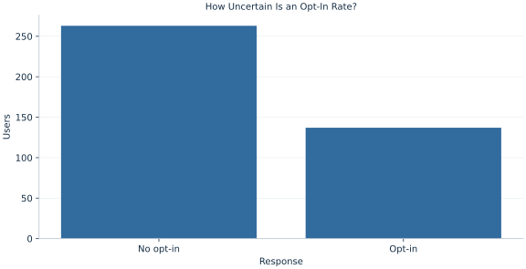

# Lab 11 · How Uncertain Is an Opt-In Rate?

> Is the opt-in rate compatible with a benchmark of 40%?

## Start with the supplied observations

Download [app_opt_in.xlsx](app_opt_in.xlsx) and [the complete Python analysis](lab.py). Import the workbook into OpenEconometrics without renaming it. Open the complete Python file in an empty Python document and run the whole file. The first sheet, **Data**, contains the observations. **Dictionary** explains variables, coding, units and missing cells.

For ordinary Python, keep the workbook beside `lab.py`. For another location, use `from lab import run_lab`, then `run_lab(data_path="/path/to/app_opt_in.xlsx")`. Keep the supplied workbook intact and use a copy for transformations. The [LaTeX result table](table.tex) accompanies the chapter.

The workbook contains **400 original synthetic observations**. Its observational unit is: One synthetic invited app user. These are teaching observations, not an empirical estimate about an actual business, population or policy. Every student starts from the same stored values and missing cells.

| Variable | Meaning | Unit or coding | Missing cells |
|---|---|---|---:|
| `user_id` | Invited user identifier | integer ID | 0 |
| `opt_in` | Observed response | 0=no, 1=yes | 0 |

## 1. Build the comparison

A sample proportion is the mean of binary observations. Its denominator is the number of eligible users observed, rather than the number who opted in. Under a specified null proportion p0, a Bernoulli observation has variance p0(1−p0). Independence makes the variance of the sample mean that quantity divided by n.

Testing and interval estimation use different uncertainty conventions here. The null z test evaluates uncertainty at p0. The native Wald interval substitutes the observed proportion. The separately calculated Wilson interval instead inverts score tests and stays within the probability scale. These intervals should be named explicitly rather than described as interchangeable “95% intervals”.

$$
z=\frac{\hat p-p_0}{\sqrt{p_0(1-p_0)/n}},\qquad p_0=.4,\quad \hat p=\frac{\sum_i y_i}{n}.
$$

Count successes, divide by 400, subtract .4, and divide by the null standard error. For Wilson limits, solving the score-test inequality yields a shifted center and an adjusted half width. This differs from placing 1.96 plug-in standard errors around the sample proportion.

## 2. State the assumptions and sample

Users are independent synthetic Bernoulli observations; each is eligible once and has a recorded binary outcome. Both null expected counts are large. Dependence among users or selective missing outcomes would require revisiting the procedure.

**Pause before running.** Why is .4 used inside the test SE while the observed rate appears in a Wald interval?

## 3. Follow the application

The complete file loads the supplied observations, applies the chapter's explicit sample rule, computes the procedure and displays the result, a chart and a compact numerical table. The following shortened call highlights the statistical operation. `load_data()` and the other chapter helpers are defined in the full file; run that file before using the snippet.

```python
import openecon as oe

raw = load_data()
result = oe.prtest(raw, "opt_in", p=0.4, positive=1)
display(result)
```

Read the output in this order: establish which observations were used, identify the quantity being compared, inspect the amount of variation or uncertainty, and then interpret the result in the units of the question. A large statistic without its denominator, sample and comparison cannot explain the result. The final numerical table puts the quantities used in the worked discussion together; the procedure output retains the fuller set of tables.

## 4. Interpret the executed example

| Quantity | Computed value |
|---|---:|
| Users | 400 |
| Opt ins | 137 |
| Sample proportion | 0.3425 |
| Null proportion | 0.4 |
| Null se | 0.0244949 |
| Z | -2.34743 |
| Two sided p | 0.0189035 |
| Wald low | 0.295995 |
| Wald high | 0.389005 |
| Wilson low | 0.297691 |
| Wilson high | 0.390305 |

Among 400 users, 137 opt in. The rate is 0.3425, z=-2.34743 and the two-sided p value 0.0189035. Wilson limits are [0.297691, 0.390305]; Wald limits are [0.295995, 0.389005]. The negative z indicates a rate below .4.



The bar chart compares opt-in and non-opt-in counts; the denominator includes both groups.

## 5. Decide what the evidence supports

The large-sample test is inappropriate for arbitrary sparse counts. A confidence interval is not a probability distribution over the fixed population proportion. This synthetic result does not measure a real app’s performance.

## 6. Try it yourself

**A.** Reconstruct the rate.

**B.** Interpret the sign of z.

**C.** Name both interval conventions.

**D.** Would repeated observations from one user preserve this SE?

## Further reading

[OpenStax, Introductory Statistics 2e](https://openstax.org/books/introductory-statistics-2e/pages/1-introduction) provides background reading. The questions, observations and worked analysis are original.
