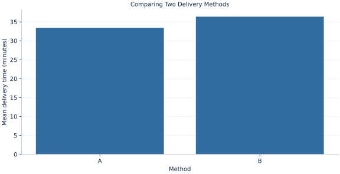

# Lab 12 · Comparing Two Delivery Methods

> Do two delivery methods have different mean elapsed times?

## Start with the supplied observations

Download [delivery_methods.xlsx](delivery_methods.xlsx) and [the complete Python analysis](lab.py). Import the workbook into OpenEconometrics without renaming it. Open the complete Python file in an empty Python document and run the whole file. The first sheet, **Data**, contains the observations. **Dictionary** explains variables, coding, units and missing cells.

For ordinary Python, keep the workbook beside `lab.py`. For another location, use `from lab import run_lab`, then `run_lab(data_path="/path/to/delivery_methods.xlsx")`. Keep the supplied workbook intact and use a copy for transformations. The [LaTeX result table](table.tex) accompanies the chapter.

The workbook contains **150 original synthetic observations**. Its observational unit is: One synthetic independent parcel delivery. These are teaching observations, not an empirical estimate about an actual business, population or policy. Every student starts from the same stored values and missing cells.

| Variable | Meaning | Unit or coding | Missing cells |
|---|---|---|---:|
| `delivery_id` | Delivery identifier | integer ID | 0 |
| `method` | Assigned delivery method | A or B | 0 |
| `minutes` | Elapsed delivery time | minutes | 0 |

## 1. Build the comparison

Independent groups provide two separate estimates of a mean. Define the contrast before interpreting its sign: this chapter uses A minus B. The variance of an independent difference is the sum of the two mean variances. Group sizes and variances need not be equal.

Welch’s test estimates each variance separately and uses the Satterthwaite degrees of freedom. A pooled-variance test imposes a common population variance. Looking at the unequal-variance row is a deliberate modeling choice, not a search for whichever row has the smaller p value.

$$
\hat\Delta=\bar x_A-\bar x_B,\quad SE=\sqrt{s_A^2/n_A+s_B^2/n_B},\quad \nu=\frac{(v_A+v_B)^2}{v_A^2/(n_A-1)+v_B^2/(n_B-1)},\ v_g=s_g^2/n_g.
$$

Independent errors imply no covariance term between group means. The estimated variance components determine both the SE and effective degrees of freedom, so the smaller or noisier group can dominate uncertainty. The confidence interval adds and subtracts a t critical value times the SE.

## 2. State the assumptions and sample

The synthetic groups are independent with unequal spreads and different sizes. No pairing is present. Normal draws make Welch’s approximation suitable; observational assignment in a real delivery study would not by itself identify a causal effect.

**Pause before running.** If A has the smaller mean, which sign should an A-minus-B contrast have?

## 3. Follow the application

The complete file loads the supplied observations, applies the chapter's explicit sample rule, computes the procedure and displays the result, a chart and a compact numerical table. The following shortened call highlights the statistical operation. `load_data()` and the other chapter helpers are defined in the full file; run that file before using the snippet.

```python
import openecon as oe

raw = load_data()
result = oe.ttest(raw, "minutes", by="method", missing="raise")
display(result["test"].loc["unequal_variances"])
```

Read the output in this order: establish which observations were used, identify the quantity being compared, inspect the amount of variation or uncertainty, and then interpret the result in the units of the question. A large statistic without its denominator, sample and comparison cannot explain the result. The final numerical table puts the quantities used in the worked discussion together; the procedure output retains the fuller set of tables.

## 4. Interpret the executed example

| Quantity | Computed value |
|---|---:|
| N a | 65 |
| N b | 85 |
| Mean a | 33.4539 |
| Mean b | 36.382 |
| Difference a minus b | -2.92812 |
| Welch se | 1.22106 |
| Welch df | 108.4 |
| Welch t | -2.39802 |
| Welch p | 0.018193 |
| Welch ci low | -5.34837 |
| Welch ci high | -0.507869 |

A averages 33.4539 minutes over 65 deliveries; B averages 36.382 over 85. A−B is -2.92812 minutes, with SE 1.22106, Welch df 108.4 and p=0.018193. The interval [-5.34837, -0.507869] is entirely negative.



Group means are descriptive comparisons. Their distance alone does not show uncertainty or individual overlap.

## 5. Decide what the evidence supports

An unequal-variance test addresses uncertainty about means, not selection into methods. Normality, independence and the measured time scale remain part of the interpretation.

## 6. Try it yourself

**A.** State the comparison direction and units.

**B.** Calculate the test ratio.

**C.** Why is the df noninteger?

**D.** Would the same analysis fit before/after measurements on the same deliveries?

## Further reading

[OpenStax, Introductory Statistics 2e](https://openstax.org/books/introductory-statistics-2e/pages/1-introduction) provides background reading. The questions, observations and worked analysis are original.
