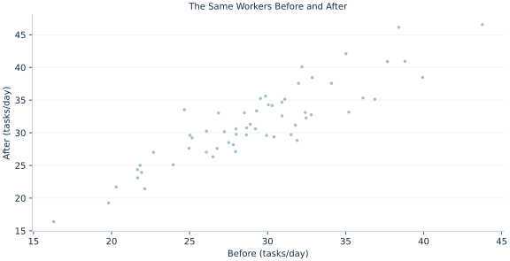

# Lab 13 · The Same Workers Before and After

> How much did performance change within the same worker?

## Start with the supplied observations

Download [worker_before_after.xlsx](worker_before_after.xlsx) and [the complete Python analysis](lab.py). Import the workbook into OpenEconometrics without renaming it. Open the complete Python file in an empty Python document and run the whole file. The first sheet, **Data**, contains the observations. **Dictionary** explains variables, coding, units and missing cells.

For ordinary Python, keep the workbook beside `lab.py`. For another location, use `from lab import run_lab`, then `run_lab(data_path="/path/to/worker_before_after.xlsx")`. Keep the supplied workbook intact and use a copy for transformations. The [LaTeX result table](table.tex) accompanies the chapter.

The workbook contains **60 original synthetic observations**. Its observational unit is: One synthetic worker observed twice. These are teaching observations, not an empirical estimate about an actual business, population or policy. Every student starts from the same stored values and missing cells.

| Variable | Meaning | Unit or coding | Missing cells |
|---|---|---|---:|
| `worker_id` | Worker identifier | integer ID | 0 |
| `before` | Baseline completed tasks | tasks/day | 0 |
| `after` | Follow-up completed tasks | tasks/day | 1 |

## 1. Build the comparison

Paired measurements carry information about dependence. A worker’s before and after outcomes share characteristics; subtracting them removes stable worker-specific levels. The relevant sample is the set of complete pairs, and the relevant spread is the spread of within-worker changes.

Analyzing all available before and after values as independent observations loses this structure. Deleting only one missing cell also changes the comparison population. Here one worker lacks an after measurement, so both measurements for that worker are excluded from the paired analysis.

$$
d_i=after_i-before_i,\quad t=\frac{\bar d}{s_d/\sqrt{n_{pairs}}},\quad df=n_{pairs}-1.
$$

Variance of a difference equals the sum of variances minus twice the covariance. Positive within-worker correlation can reduce the variance of changes. Compute each change first, then apply a one-sample mean procedure to those changes.

## 2. State the assumptions and sample

Workers are independent of one another; dependence within a worker is retained. Complete-case selection is explicit. A normal change mechanism supports t inference, but a real missing-after process could make retained workers unrepresentative.

**Pause before running.** Can the paired sample have 60 before values and 59 after values?

## 3. Follow the application

The complete file loads the supplied observations, applies the chapter's explicit sample rule, computes the procedure and displays the result, a chart and a compact numerical table. The following shortened call highlights the statistical operation. `load_data()` and the other chapter helpers are defined in the full file; run that file before using the snippet.

```python
import openecon as oe

raw = load_data()
pairs = raw.dropna(subset=["before", "after"])
result = oe.ttest(pairs, "after", paired_with="before", missing="raise")
display(result)
```

Read the output in this order: establish which observations were used, identify the quantity being compared, inspect the amount of variation or uncertainty, and then interpret the result in the units of the question. A large statistic without its denominator, sample and comparison cannot explain the result. The final numerical table puts the quantities used in the worked discussion together; the procedure output retains the fuller set of tables.

## 4. Interpret the executed example

| Quantity | Computed value |
|---|---:|
| Raw workers | 60 |
| Complete pairs | 59 |
| Excluded pairs | 1 |
| Mean after minus before | 2.24555 |
| Sd difference | 2.70573 |
| Paired se | 0.352257 |
| T | 6.37477 |
| Df | 58 |
| Two sided p | 3.26049e-08 |
| Ci low | 1.54044 |
| Ci high | 2.95067 |

Of 60 workers, 59 supply complete pairs. Mean after−before is 2.24555 points, with SE 0.352257 and df 58. The interval [1.54044, 2.95067] excludes zero; p=3.26049e-08.



The histogram contains one change per retained worker, not two independent scores.

## 5. Decide what the evidence supports

An average change is not automatically a treatment effect: time trends, practice or other events could explain before/after differences without a control group.

## 6. Try it yourself

**A.** Reconcile the sample counts.

**B.** Reconstruct the SE.

**C.** Explain the positive sign.

**D.** Does a small p prove the training caused improvement?

## Further reading

[OpenStax, Introductory Statistics 2e](https://openstax.org/books/introductory-statistics-2e/pages/1-introduction) provides background reading. The questions, observations and worked analysis are original.
