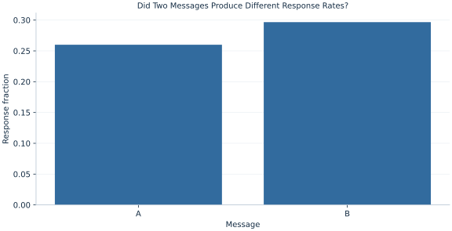

# Lab 14 · Did Two Messages Produce Different Response Rates?

> Are response rates different for two messages?

## Start with the supplied observations

Download [message_responses.xlsx](message_responses.xlsx) and [the complete Python analysis](lab.py). Import the workbook into OpenEconometrics without renaming it. Open the complete Python file in an empty Python document and run the whole file. The first sheet, **Data**, contains the observations. **Dictionary** explains variables, coding, units and missing cells.

For ordinary Python, keep the workbook beside `lab.py`. For another location, use `from lab import run_lab`, then `run_lab(data_path="/path/to/message_responses.xlsx")`. Keep the supplied workbook intact and use a copy for transformations. The [LaTeX result table](table.tex) accompanies the chapter.

The workbook contains **600 original synthetic observations**. Its observational unit is: One synthetic recipient assigned one message. These are teaching observations, not an empirical estimate about an actual business, population or policy. Every student starts from the same stored values and missing cells.

| Variable | Meaning | Unit or coding | Missing cells |
|---|---|---|---:|
| `recipient_id` | Recipient identifier | integer ID | 0 |
| `message` | Randomized message label | A or B | 0 |
| `response` | Response within the stated follow-up | 0=no, 1=yes | 0 |

## 1. Build the comparison

A two-proportion comparison measures a difference in probabilities. A difference of .04 means four percentage points; it is not automatically a four percent relative increase. Define A minus B so group ordering stays visible.

Under the equality null, both groups share an unknown probability, estimated by the pooled success count. The z test uses this pooled null variance. The ordinary confidence interval estimates separate group variances and is unpooled. Reporting both conventions explains why the test statistic is not obtained by dividing the difference by the interval SE.

$$
z=\frac{\hat p_A-\hat p_B}{\sqrt{\hat p_{pool}(1-\hat p_{pool})(1/n_A+1/n_B)}},\quad SE_{CI}=\sqrt{\hat p_A(1-\hat p_A)/n_A+\hat p_B(1-\hat p_B)/n_B}.
$$

The pooled rate divides combined successes by combined trials. Independent-group variances add. Multiply a rate difference by 100 to express percentage points; divide by a baseline only when defining a relative percentage change.

## 2. State the assumptions and sample

Each customer sees one message; groups are independent, binary outcomes are fully recorded and counts support normal approximation. Real randomized assignment would need preservation of eligibility and outcome definitions.

**Pause before running.** Will pooled and unpooled SEs be identical when observed rates differ?

## 3. Follow the application

The complete file loads the supplied observations, applies the chapter's explicit sample rule, computes the procedure and displays the result, a chart and a compact numerical table. The following shortened call highlights the statistical operation. `load_data()` and the other chapter helpers are defined in the full file; run that file before using the snippet.

```python
import openecon as oe

raw = load_data()
result = oe.prtest(raw, "response", by="message")
display(result)
```

Read the output in this order: establish which observations were used, identify the quantity being compared, inspect the amount of variation or uncertainty, and then interpret the result in the units of the question. A large statistic without its denominator, sample and comparison cannot explain the result. The final numerical table puts the quantities used in the worked discussion together; the procedure output retains the fuller set of tables.

## 4. Interpret the executed example

| Quantity | Computed value |
|---|---:|
| N a | 300 |
| N b | 300 |
| Rate a | 0.26 |
| Rate b | 0.296667 |
| Difference a minus b | -0.0366667 |
| Difference percentage points | -3.66667 |
| Pooled null se | 0.0365936 |
| Unpooled interval se | 0.036563 |
| Z | -1.002 |
| Two sided p | 0.316345 |
| Ci low | -0.108329 |
| Ci high | 0.0349955 |

Rates are 0.26 for A and 0.296667 for B. A−B is -3.66667 percentage points. The pooled test gives z=-1.002, p=0.316345. The unpooled interval [-0.108329, 0.0349955] includes zero.



The bars show response rates on the same probability scale and retain the same eligible-user denominator in each group.

## 5. Decide what the evidence supports

Non-rejection does not establish equality or practical equivalence. The interval includes both positive and negative differences; relevant decision thresholds require domain information.

## 6. Try it yourself

**A.** Convert the contrast to percentage points.

**B.** Which SE enters z?

**C.** Interpret the interval crossing zero.

**D.** Does p>.05 prove messages are equivalent?

## Further reading

[OpenStax, Introductory Statistics 2e](https://openstax.org/books/introductory-statistics-2e/pages/1-introduction) provides background reading. The questions, observations and worked analysis are original.
