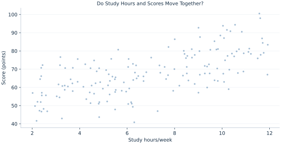

# Lab 15 · Do Study Hours and Scores Move Together?

> How strongly are study hours and scores linearly associated?

## Start with the supplied observations

Download [study_hours_scores.xlsx](study_hours_scores.xlsx) and [the complete Python analysis](lab.py). Import the workbook into OpenEconometrics without renaming it. Open the complete Python file in an empty Python document and run the whole file. The first sheet, **Data**, contains the observations. **Dictionary** explains variables, coding, units and missing cells.

For ordinary Python, keep the workbook beside `lab.py`. For another location, use `from lab import run_lab`, then `run_lab(data_path="/path/to/study_hours_scores.xlsx")`. Keep the supplied workbook intact and use a copy for transformations. The [LaTeX result table](table.tex) accompanies the chapter.

The workbook contains **160 original synthetic observations**. Its observational unit is: One synthetic student. These are teaching observations, not an empirical estimate about an actual business, population or policy. Every student starts from the same stored values and missing cells.

| Variable | Meaning | Unit or coding | Missing cells |
|---|---|---|---:|
| `student_id` | Student identifier | integer ID | 0 |
| `hours` | Weekly study time | hours/week | 0 |
| `score` | Assessment score | points | 2 |

## 1. Build the comparison

Correlation standardizes covariance by both marginal standard deviations. It is dimensionless and symmetric: swapping hours and scores does not change r. Regression slopes are directional and have units, so a correlation is not a slope.

Pearson correlation measures linear association. A nonlinear relationship can have a small r, and an outlier can influence it strongly. The scatter plot is therefore part of analysis, not decoration. This chapter uses complete pairs for hours and score and reports that common denominator.

$$
r=\frac{\sum_i(x_i-\bar x)(y_i-\bar y)}{\sqrt{\sum_i(x_i-\bar x)^2\sum_i(y_i-\bar y)^2}},\quad t=r\sqrt{\frac{n-2}{1-r^2}}.
$$

Center both variables, multiply centered values and divide by their Euclidean lengths. The zero-correlation test uses n−2 degrees of freedom under a bivariate-normal null model. In a simple regression with an intercept, r squared equals the fraction of sample outcome variation fitted linearly.

## 2. State the assumptions and sample

Rows are independent synthetic students. Two scores are missing, and both variables use the same retained 158 students. The inferential model assumes a suitable bivariate distribution; causal interpretation would require a separate identification argument.

**Pause before running.** Would changing hours to minutes change r or the regression slope?

## 3. Follow the application

The complete file loads the supplied observations, applies the chapter's explicit sample rule, computes the procedure and displays the result, a chart and a compact numerical table. The following shortened call highlights the statistical operation. `load_data()` and the other chapter helpers are defined in the full file; run that file before using the snippet.

```python
import openecon as oe

raw = load_data()
data = raw.dropna(subset=["hours", "score"])
result = oe.correlate(data, ["hours", "score"], method="pearson", pairwise=False, ci=True)
display(result)
```

Read the output in this order: establish which observations were used, identify the quantity being compared, inspect the amount of variation or uncertainty, and then interpret the result in the units of the question. A large statistic without its denominator, sample and comparison cannot explain the result. The final numerical table puts the quantities used in the worked discussion together; the procedure output retains the fuller set of tables.

## 4. Interpret the executed example

| Quantity | Computed value |
|---|---:|
| Raw students | 160 |
| Complete students | 158 |
| Excluded students | 2 |
| Pearson r | 0.651979 |
| Two sided p | 1.72347e-20 |
| T for zero correlation | 10.7397 |
| Df | 156 |
| Variance fraction linear association | 0.425076 |

The complete sample contains 158 students, excluding 2 rows. Pearson r=0.651979 and the zero-correlation p value is 1.72347e-20. The corresponding r squared is 0.425076, a linear fit description for this sample.



The scatter displays hours and scores in their original units. Look for curvature and influential points before relying on a single correlation.

## 5. Decide what the evidence supports

Association can reflect confounding, selection, reverse causality or a joint mechanism. r squared is not the percentage of scores caused by study hours.

## 6. Try it yourself

**A.** Reconcile retained observations.

**B.** What happens when hours become minutes?

**C.** Interpret r squared carefully.

**D.** Can r=0 rule out all dependence?

## Further reading

[OpenStax, Introductory Statistics 2e](https://openstax.org/books/introductory-statistics-2e/pages/1-introduction) provides background reading. The questions, observations and worked analysis are original.
