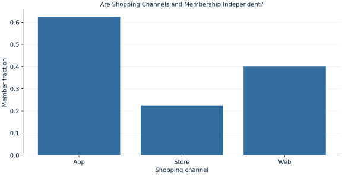

# Lab 16 · Are Shopping Channels and Membership Independent?

> Is shopping channel independent of membership?

## Start with the supplied observations

Download [shopping_channels.xlsx](shopping_channels.xlsx) and [the complete Python analysis](lab.py). Import the workbook into OpenEconometrics without renaming it. Open the complete Python file in an empty Python document and run the whole file. The first sheet, **Data**, contains the observations. **Dictionary** explains variables, coding, units and missing cells.

For ordinary Python, keep the workbook beside `lab.py`. For another location, use `from lab import run_lab`, then `run_lab(data_path="/path/to/shopping_channels.xlsx")`. Keep the supplied workbook intact and use a copy for transformations. The [LaTeX result table](table.tex) accompanies the chapter.

The workbook contains **360 original synthetic observations**. Its observational unit is: One synthetic shopping transaction. These are teaching observations, not an empirical estimate about an actual business, population or policy. Every student starts from the same stored values and missing cells.

| Variable | Meaning | Unit or coding | Missing cells |
|---|---|---|---:|
| `transaction_id` | Transaction identifier | integer ID | 0 |
| `channel` | Observed shopping channel | Store, Web or App | 0 |
| `member` | Membership at purchase | 0=no, 1=yes | 0 |

## 1. Build the comparison

Independence means that channel probabilities do not change with membership. A contingency table preserves both margins while displaying joint counts. Under independence the expected count in a cell is its row total times its column total divided by the grand total.

Pearson’s statistic sums squared observed-minus-expected deviations divided by expected counts. Dividing makes departures from small expected cells matter differently from the same raw departure in a large cell. The test addresses the joint table, rather than a separate hypothesis for every cell.

$$
E_{rc}=\frac{n_{r+}n_{+c}}n,\quad X^2=\sum_{r,c}\frac{(O_{rc}-E_{rc})^2}{E_{rc}},\quad df=(R-1)(C-1).
$$

With three channels and two membership states, df=2. Fixing all row and column margins constrains cell deviations, leaving this number of independent directions. Cramér’s V rescales the chi-square statistic as sqrt(X²/[n min(R−1,C−1)]).

## 2. State the assumptions and sample

Transactions are independent; every transaction falls into exactly one channel and membership state. All expected counts are adequate for chi-square approximation. Multiple transactions from one shopper would violate this simple independence assumption.

**Pause before running.** If channel labels are recoded 1, 2 and 3, should their numerical mean enter this test?

## 3. Follow the application

The complete file loads the supplied observations, applies the chapter's explicit sample rule, computes the procedure and displays the result, a chart and a compact numerical table. The following shortened call highlights the statistical operation. `load_data()` and the other chapter helpers are defined in the full file; run that file before using the snippet.

```python
import openecon as oe

raw = load_data()
result = oe.crosstab(raw, "channel", "member", expected=True, exact=False)
display(result)
```

Read the output in this order: establish which observations were used, identify the quantity being compared, inspect the amount of variation or uncertainty, and then interpret the result in the units of the question. A large statistic without its denominator, sample and comparison cannot explain the result. The final numerical table puts the quantities used in the worked discussion together; the procedure output retains the fuller set of tables.

## 4. Interpret the executed example

| Quantity | Computed value |
|---|---:|
| Transactions | 360 |
| Pearson chi squared | 39.7029 |
| Df | 2 |
| P value | 2.3913e-09 |
| Minimum expected count | 50 |
| Cramers v | 0.332093 |

For 360 transactions, X²=39.7029 with 2 degrees of freedom and p=2.3913e-09. The minimum expected count is 50. Cramér’s V=0.332093 summarizes association on this table.



Channel-specific membership rates help locate the departure, while the chi-square statistic tests the whole table.

## 5. Decide what the evidence supports

The result does not identify which channel causes membership or which cell alone is responsible. A follow-up comparison needs its own uncertainty and multiplicity plan.

## 6. Try it yourself

**A.** Compute df.

**B.** Explain an expected count.

**C.** Would permuting channel names change X²?

**D.** Does significance establish a channel effect on membership?

## Further reading

[OpenStax, Introductory Statistics 2e](https://openstax.org/books/introductory-statistics-2e/pages/1-introduction) provides background reading. The questions, observations and worked analysis are original.
