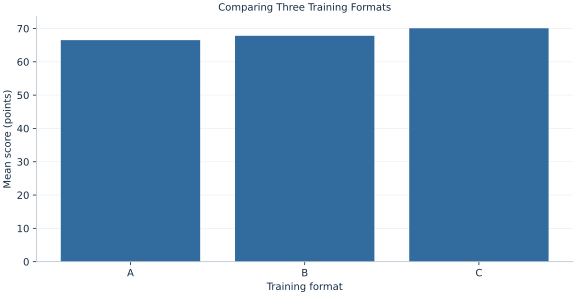

# Lab 17 · Comparing Three Training Formats

> Do three training formats have the same mean score?

## Start with the supplied observations

Download [training_formats.xlsx](training_formats.xlsx) and [the complete Python analysis](lab.py). Import the workbook into OpenEconometrics without renaming it. Open the complete Python file in an empty Python document and run the whole file. The first sheet, **Data**, contains the observations. **Dictionary** explains variables, coding, units and missing cells.

For ordinary Python, keep the workbook beside `lab.py`. For another location, use `from lab import run_lab`, then `run_lab(data_path="/path/to/training_formats.xlsx")`. Keep the supplied workbook intact and use a copy for transformations. The [LaTeX result table](table.tex) accompanies the chapter.

The workbook contains **135 original synthetic observations**. Its observational unit is: One synthetic independently assigned trainee. These are teaching observations, not an empirical estimate about an actual business, population or policy. Every student starts from the same stored values and missing cells.

| Variable | Meaning | Unit or coding | Missing cells |
|---|---|---|---:|
| `trainee_id` | Trainee identifier | integer ID | 0 |
| `format` | Assigned format | A, B or C | 0 |
| `score` | Post-training test score | points | 0 |

## 1. Build the comparison

An omnibus ANOVA compares a model with one common mean against a model with a separate mean for each format. Total centered variation decomposes into between-group and within-group sums of squares. If mean differences are large relative to within-group variation, the F ratio increases.

Rejecting the omnibus null means that at least one population mean differs. It does not establish that every pair differs. The supplied post-hoc table applies Bonferroni adjustment to three pairwise comparisons; a Welch alternative is also retained to discuss unequal variance assumptions.

$$
F=\frac{SS_B/(G-1)}{SS_W/(n-G)},\quad SS_T=SS_B+SS_W,\quad \eta^2=SS_B/SS_T.
$$

Between-group variation weights squared group-mean departures by group size. Within-group variation sums deviations from each group’s own mean. Dividing each sum by its degrees of freedom produces comparable mean squares. Bonferroni multiplies each raw pairwise p value by the number of comparisons, capped at one.

## 2. State the assumptions and sample

Trainees are independent synthetic draws with common variance across formats for the classical F example. Groups each contain 45 observations. A real observational comparison of formats could have both variance heterogeneity and selection.

**Pause before running.** Can the omnibus null be rejected even when not every pairwise comparison is significant?

## 3. Follow the application

The complete file loads the supplied observations, applies the chapter's explicit sample rule, computes the procedure and displays the result, a chart and a compact numerical table. The following shortened call highlights the statistical operation. `load_data()` and the other chapter helpers are defined in the full file; run that file before using the snippet.

```python
import openecon as oe

raw = load_data()
result = oe.oneway(raw, "score", "format", posthoc=["bonferroni"], welch=True)
display(result)
```

Read the output in this order: establish which observations were used, identify the quantity being compared, inspect the amount of variation or uncertainty, and then interpret the result in the units of the question. A large statistic without its denominator, sample and comparison cannot explain the result. The final numerical table puts the quantities used in the worked discussion together; the procedure output retains the fuller set of tables.

## 4. Interpret the executed example

| Quantity | Computed value |
|---|---:|
| Trainees | 135 |
| Groups | 3 |
| Ss between | 292.857 |
| Ss within | 4051.27 |
| Ss total | 4344.12 |
| Df between | 2 |
| Df within | 132 |
| F | 4.77098 |
| P value | 0.00998744 |
| Eta squared | 0.0674144 |
| Bonferroni comparisons | 3 |

Among 135 trainees, F=4.77098 on 2 and 132 degrees of freedom, p=0.00998744. Between-group SS is 292.857, within-group SS 4051.27 and total SS 4344.12. η²=0.0674144 describes the sample variation associated with group means.



The group-mean bars show the comparison’s direction but cannot replace the within-group spread or adjusted pairwise evidence.

## 5. Decide what the evidence supports

An omnibus p value does not rank formats causally. η² is a sample decomposition, not a causal variance share. Post-hoc inference and the choice between common and unequal variance require explicit conventions.

## 6. Try it yourself

**A.** Reconstruct F.

**B.** Reconcile sums of squares.

**C.** How many pairwise comparisons exist?

**D.** Does rejecting equality say all means differ?

## Further reading

[OpenStax, Introductory Statistics 2e](https://openstax.org/books/introductory-statistics-2e/pages/1-introduction) provides background reading. The questions, observations and worked analysis are original.
