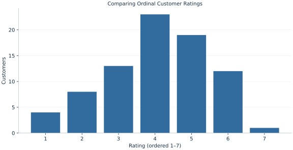

# Lab 18 · Comparing Ordinal Customer Ratings

> How do two services compare when customer ratings are ordinal and tied?

## Start with the supplied observations

Download [customer_ratings.xlsx](customer_ratings.xlsx) and [the complete Python analysis](lab.py). Import the workbook into OpenEconometrics without renaming it. Open the complete Python file in an empty Python document and run the whole file. The first sheet, **Data**, contains the observations. **Dictionary** explains variables, coding, units and missing cells.

For ordinary Python, keep the workbook beside `lab.py`. For another location, use `from lab import run_lab`, then `run_lab(data_path="/path/to/customer_ratings.xlsx")`. Keep the supplied workbook intact and use a copy for transformations. The [LaTeX result table](table.tex) accompanies the chapter.

The workbook contains **80 original synthetic observations**. Its observational unit is: One synthetic independent customer rating. These are teaching observations, not an empirical estimate about an actual business, population or policy. Every student starts from the same stored values and missing cells.

| Variable | Meaning | Unit or coding | Missing cells |
|---|---|---|---:|
| `customer_id` | Customer identifier | integer ID | 0 |
| `service` | Service group | A or B | 0 |
| `rating` | Ordered satisfaction response | integer scale 1–7 | 0 |

## 1. Build the comparison

Ordinal ratings have an order without guaranteeing equal distances between adjacent categories. The Mann–Whitney statistic compares relative ranks. Midranks allocate tied observations the average of their rank positions. A tie contributes half a win to a pairwise probability comparison.

This chapter’s U for service A counts A>B plus half of A=B over all cross-service pairs. Dividing by nA nB estimates the probability that a random A rating exceeds a random B rating, with half credit for ties. It is not automatically a test of medians: that interpretation requires additional common-shape assumptions.

$$
U_A=\sum_{i\in A,j\in B}\left[1(x_i>x_j)+\tfrac12 1(x_i=x_j)\right],\quad \hat P=U_A/(n_A n_B).
$$

Pool both samples, assign midranks, then subtract nA(nA+1)/2 from A’s rank sum. This equals the direct pair-count formula. The asymptotic z variance is tie-corrected; no continuity correction is used here, and an exact no-tie distribution would be inappropriate for these tied categories.

## 2. State the assumptions and sample

Customers are independent between and within services. Ratings share the same ordered coding. There are many ties and the native analysis deliberately uses asymptotic inference. Sample membership may be selected rather than randomized.

**Pause before running.** Why should a tied A/B pair contribute .5 rather than zero or one?

## 3. Follow the application

The complete file loads the supplied observations, applies the chapter's explicit sample rule, computes the procedure and displays the result, a chart and a compact numerical table. The following shortened call highlights the statistical operation. `load_data()` and the other chapter helpers are defined in the full file; run that file before using the snippet.

```python
import openecon as oe

raw = load_data()
result = oe.ranksum(raw, "rating", "service", exact=False)
display(result)
```

Read the output in this order: establish which observations were used, identify the quantity being compared, inspect the amount of variation or uncertainty, and then interpret the result in the units of the question. A large statistic without its denominator, sample and comparison cannot explain the result. The final numerical table puts the quantities used in the worked discussion together; the procedure output retains the fuller set of tables.

## 4. Interpret the executed example

| Quantity | Computed value |
|---|---:|
| N a | 40 |
| N b | 40 |
| U a | 733 |
| Rank sum a | 1553 |
| Probability a exceeds b with half ties | 0.458125 |
| Z without continuity correction | -0.66 |
| Asymptotic two sided p | 0.509254 |
| Tied pair fraction | 0.19875 |

With 40 A and 40 B ratings, U_A=733 and the A rank sum is 1553. The pair probability is 0.458125. Tie-corrected p=0.509254; 0.19875 of cross-group pairs are tied.



The category counts display the tied ordinal support. Avoid reading equal horizontal spacing as an assumption of cardinal utility.

## 5. Decide what the evidence supports

Non-rejection does not establish identical service distributions. A rank test can respond to location, spread or shape changes, and does not identify a causal service effect.

## 6. Try it yourself

**A.** Reconstruct U from the rank sum.

**B.** Calculate the pair probability.

**C.** Which inference convention is used?

**D.** Is this always a median test?

## Further reading

[OpenStax, Introductory Statistics 2e](https://openstax.org/books/introductory-statistics-2e/pages/1-introduction) provides background reading. The questions, observations and worked analysis are original.
