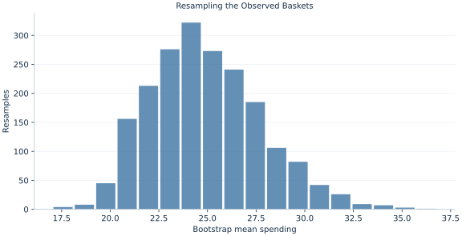

# Lab 19 · Resampling the Observed Baskets

> Can resampling the observed baskets approximate uncertainty in their mean?

## Start with the supplied observations

Download [bootstrap_baskets.xlsx](bootstrap_baskets.xlsx) and [the complete Python analysis](lab.py). Import the workbook into OpenEconometrics without renaming it. Open the complete Python file in an empty Python document and run the whole file. The first sheet, **Data**, contains the observations. **Dictionary** explains variables, coding, units and missing cells.

For ordinary Python, keep the workbook beside `lab.py`. For another location, use `from lab import run_lab`, then `run_lab(data_path="/path/to/bootstrap_baskets.xlsx")`. Keep the supplied workbook intact and use a copy for transformations. The [LaTeX result table](table.tex) accompanies the chapter.

The workbook contains **90 original synthetic observations**. Its observational unit is: One synthetic observed shopping basket. These are teaching observations, not an empirical estimate about an actual business, population or policy. Every student starts from the same stored values and missing cells.

| Variable | Meaning | Unit or coding | Missing cells |
|---|---|---|---:|
| `basket_id` | Basket identifier | integer ID | 0 |
| `spending` | Observed basket expenditure | hypothetical currency/basket | 0 |

## 1. Build the comparison

The nonparametric bootstrap treats the observed sample as an empirical population. Each replication samples n baskets with replacement and recomputes the mean. Replacement matters: a basket can appear several times, and some original baskets can be absent. The resampling variation approximates sampling uncertainty under an independent, representative sampling model.

Percentile limits use quantiles of the resampled statistic directly. They differ from a symmetric t interval and can reflect skewness. They are not universally accurate, especially with small samples, rare tails or dependent observations. The chapter fixes the random seed and replication count so execution is reproducible.

$$
\bar x_b^*=n^{-1}\sum_{i=1}^n x_{I_{bi}},\ I_{bi}\sim Uniform\{1,\ldots,n\},\quad SE_{emp}=\sqrt{\frac{n-1}{n}}\frac{s}{\sqrt n}.
$$

The empirical distribution assigns mass 1/n to each observed basket. Its variance uses denominator n, explaining the finite empirical factor relative to s. Across 1999 replication means, the usual sample standard deviation estimates bootstrap SE. Quantiles at .025 and .975 define the percentile interval.

## 2. State the assumptions and sample

The 90 prepared baskets are independent positive, skewed synthetic spending observations. Resample whole baskets, not individual column cells. The analysis uses 1999 draws with seed 991019 and Torch’s stated linear quantile convention.

**Pause before running.** Would sampling 90 baskets without replacement from these 90 observations generate useful mean variation?

## 3. Follow the application

The complete file loads the supplied observations, applies the chapter's explicit sample rule, computes the procedure and displays the result, a chart and a compact numerical table. The following shortened call highlights the statistical operation. `load_data()` and the other chapter helpers are defined in the full file; run that file before using the snippet.

```python
import openecon as oe

raw = load_data()
# analyze resamples the supplied baskets, not a regenerated dataset.
summary, native, panels, checks, models = analyze(raw)
display(native)
```

Read the output in this order: establish which observations were used, identify the quantity being compared, inspect the amount of variation or uncertainty, and then interpret the result in the units of the question. A large statistic without its denominator, sample and comparison cannot explain the result. The final numerical table puts the quantities used in the worked discussion together; the procedure output retains the fuller set of tables.

## 4. Interpret the executed example

| Quantity | Computed value |
|---|---:|
| Baskets | 90 |
| Resamples | 1999 |
| Sample mean | 24.9277 |
| Bootstrap mean | 24.8918 |
| Bootstrap se | 2.86531 |
| Empirical distribution exact se | 2.89412 |
| Percentile low | 20.2469 |
| Percentile high | 31.1707 |
| T interval low | 19.1449 |
| T interval high | 30.7105 |

The observed mean is 24.9277 currency. Across 1999 resamples, the bootstrap mean is 24.8918 and bootstrap SE 2.86531; the exact empirical-distribution SE is 2.89412. Percentile limits are [20.2469, 31.1707], compared with t limits [19.1449, 30.7105].



The histogram shows resampled means, rather than individual basket amounts. Its spread concerns the estimator.

## 5. Decide what the evidence supports

Resampling cannot supply unobserved rare events or repair a biased sample. A bootstrap interval inherits the sampling-unit and dependence assumptions. Monte Carlo differences from changing the seed are separate from changing observations.

## 6. Try it yourself

**A.** Why sample with replacement?

**B.** Distinguish the two SEs.

**C.** Why may the bootstrap average differ from the original mean?

**D.** Would this fix selection bias in baskets?

## Further reading

[OpenStax, Introductory Statistics 2e](https://openstax.org/books/introductory-statistics-2e/pages/1-introduction) provides background reading. The questions, observations and worked analysis are original.
