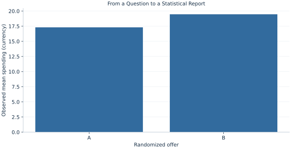

# Lab 20 · From a Question to a Statistical Report

> How should a statistical report connect its question, missing outcomes, primary test and secondary analysis?

## Start with the supplied observations

Download [campus_cafe_offer.xlsx](campus_cafe_offer.xlsx) and [the complete Python analysis](lab.py). Import the workbook into OpenEconometrics without renaming it. Open the complete Python file in an empty Python document and run the whole file. The first sheet, **Data**, contains the observations. **Dictionary** explains variables, coding, units and missing cells.

For ordinary Python, keep the workbook beside `lab.py`. For another location, use `from lab import run_lab`, then `run_lab(data_path="/path/to/campus_cafe_offer.xlsx")`. Keep the supplied workbook intact and use a copy for transformations. The [LaTeX result table](table.tex) accompanies the chapter.

The workbook contains **240 original synthetic observations**. Its observational unit is: One synthetic customer assigned an offer and followed once. These are teaching observations, not an empirical estimate about an actual business, population or policy. Every student starts from the same stored values and missing cells.

| Variable | Meaning | Unit or coding | Missing cells |
|---|---|---|---:|
| `customer_id` | Customer identifier | integer ID | 0 |
| `offer` | Randomized offer | A=standard, B=discount | 0 |
| `spending` | Follow-up spending; six responses missing | hypothetical currency/customer | 6 |
| `returned` | Return visit observed for all customers | 0=no, 1=yes | 0 |

## 1. Build the comparison

A coherent report declares the primary outcome and contrast before inspecting p values. This chapter compares spending for a synthetic cafe offer, using A minus B as the contrast. Randomized assignment concerns the initial 240 customers; spending is missing for six B customers, so the observed-spending comparison has 234 observations.

Return behavior is a secondary binary outcome recorded for all customers. These outcomes have different denominators. Reporting both with the same sample count would obscure missingness. The chapter retains raw p values and applies Holm’s two-hypothesis adjustment as a separate family-level analysis, rather than silently changing which outcome was primary.

$$
\hat\Delta_C=\bar C_A-\bar C_B,\quad SE_C=\sqrt{s_A^2/n_A+s_B^2/n_B},\quad p^{Holm}_{(j)}=\min\{1,\max_{k\le j}(m-k+1)p_{(k)}\}.
$$

For the spending comparison use Welch’s variance and degrees of freedom. For return rates use a two-proportion comparison. Holm sorts the two p values, multiplies the smallest by two and the larger by one, then enforces monotonicity. State whether the primary conclusion is prespecified or family-adjusted.

## 2. State the assumptions and sample

Assignment is randomized in the supplied synthetic mechanism. Missing spending occurs only in B, so a complete-case spending effect needs a missingness assumption beyond initial randomization. Return outcomes remain complete. Family membership is the two declared outcomes.

**Pause before running.** Can random assignment alone guarantee that the retained spending sample remains comparable after missing outcomes?

## 3. Follow the application

The complete file loads the supplied observations, applies the chapter's explicit sample rule, computes the procedure and displays the result, a chart and a compact numerical table. The following shortened call highlights the statistical operation. `load_data()` and the other chapter helpers are defined in the full file; run that file before using the snippet.

```python
import openecon as oe

raw = load_data()
spending = raw.dropna(subset=["spending"])
primary = oe.ttest(spending, "spending", by="offer", missing="raise")
secondary = oe.prtest(raw, "returned", by="offer")
display(primary)
display(secondary)
```

Read the output in this order: establish which observations were used, identify the quantity being compared, inspect the amount of variation or uncertainty, and then interpret the result in the units of the question. A large statistic without its denominator, sample and comparison cannot explain the result. The final numerical table puts the quantities used in the worked discussion together; the procedure output retains the fuller set of tables.

## 4. Interpret the executed example

| Quantity | Computed value |
|---|---:|
| Randomized customers | 240 |
| Spending observed | 234 |
| Spending missing | 6 |
| N a spending | 120 |
| N b spending | 114 |
| Mean a spending | 17.3127 |
| Mean b spending | 19.4706 |
| Spending difference a minus b | -2.15781 |
| Welch se | 0.753917 |
| Welch df | 225.918 |
| Welch t | -2.86214 |
| Primary p | 0.00460324 |
| Primary ci low | -3.64342 |
| Primary ci high | -0.672206 |
| Return rate difference a minus b | 0.025 |
| Secondary p | 0.673808 |
| Holm primary p | 0.00920647 |
| Holm secondary p | 0.673808 |

Spending is observed for 234 of 240 customers: 120 A and 114 B. A−B spending is -2.15781 currency with interval [-3.64342, -0.672206] and raw p=0.00460324. Return-rate A−B is 0.025 with p=0.673808. Holm-adjusted p values are 0.00920647 and 0.673808.



The mean-spending bars describe only observed outcomes. Keep their denominator distinct from the complete return-rate comparison.

## 5. Decide what the evidence supports

The report must disclose all six missing spending values and the assumption under which retained comparisons support a treatment interpretation. A significant primary result does not justify ignoring missingness, changing the outcome family or overinterpreting a nonsignificant secondary result.

## 6. Try it yourself

**A.** Reconcile both denominators.

**B.** Report the spending contrast in words.

**C.** Explain the Holm calculation.

**D.** What prevents an unconditional causal spending claim?

## Further reading

[OpenStax, Introductory Statistics 2e](https://openstax.org/books/introductory-statistics-2e/pages/1-introduction) provides background reading. The questions, observations and worked analysis are original.
